<Frame>
  
</Frame>

# 🔥 How to Do an IRR Battle with Your Friends at the BBQ

<Note>
  🍖 **FINANCIAL GLADIATOR ARENA PRESENTS:** Turn brisket into balance sheets. Social flex meets Excel deathmatch.
</Note>

## 🎪 Welcome to the Hottest Party Game Since Beer Pong

```mermaid
flowchart TD
    A[Regular BBQ] --> B{Add IRR Battles?}
    B -->|No| C[😴 Boring Small Talk About Weather]
    B -->|Yes| D[🔥 LEGENDARY PARTY STATUS]
    D --> E[Friends Questioning Reality]
    E --> F[Someone Actually Learns Finance]
    F --> G[🏆 You Become Party Legend]
    C --> H[Everyone Forgets Your Party]
```

<Warning>
  **WARNING:** Once you introduce IRR battles to your social circle, regular conversations about sports and weather will feel intellectually vacant. Proceed with caution.
</Warning>

---

## 🍗 Chapter 1: Why Finance Should Never Be Boring

<CardGroup cols={3}>
  <Card title="🎯 Social Evolution" icon="users">
    Barbecues used to be about ribs and red Solo cups. Now it's about **flexing your cashflow projections**.
  </Card>
  <Card title="🏆 Alpha Status" icon="crown">
    Real alphas don't just grill—they discount future cash flows while manning the smoker.
  </Card>
  <Card title="🧠 Stealth Education" icon="brain">
    Learn finance through combat. Darwin would be proud.
  </Card>
</CardGroup>

### The Evolution of Party Games

<Tabs>
  <Tab title="🍺 The Old Days">
    **What We Used to Do:**

    - Beer pong (requires hand-eye coordination)
    - Crypto shilling (requires gullible friends)
    - Arguing about sports (requires caring about sports)

    **Results:** Temporary fun, zero skill development, same conversations every time
  </Tab>
  <Tab title="🔥 The New Hotness">
    **What Elite Parties Do Now:**

    - IRR battle royales (requires imagination \+ basic math)
    - Live pitch competitions over pork shoulder
    - Financial modeling while intoxicated

    **Results:** Legendary status, accidental learning, stories for years
  </Tab>
  <Tab title="🚀 The Future">
    **Where This is Heading:**

    - DSCR drinking games
    - Cap rate karaoke contests
    - Leverage limbo competitions
    - NPV speed dating events

    **Results:** A generation that actually understands money
  </Tab>
</Tabs>

---

## 🧾 Chapter 2: The Battle Setup - Choose Your Investment Fantasy

<AccordionGroup>
  <Accordion title="🎭 Team Formation & Character Creation" icon="users">
    **The Classic Squad (4-6 players ideal):**

    - 🦈 **The Shark**: Always projects 100%\+ IRR, uses phrases like "hockey stick growth"
    - 🤡 **The Comedian**: Picks the most absurd businesses but somehow makes them work mathematically
    - 🤓 **The Analyst**: Actually understands finance, ruins everyone's fun with "realistic assumptions"
    - 🎪 **The Showman**: Best presentation skills, worst business ideas
    - 😵 **The Confused Friend**: Has no idea what's happening but is having a great time
    - 🧠 **The Dark Horse**: Quiet until they drop a genius business model that breaks everyone's brain
  </Accordion>
  <Accordion title="🎯 Deal Selection Criteria" icon="target">
    **The Golden Rules:**

    1. **Must be completely ridiculous** (but not impossible)
    2. **Must involve at least one dead trend** (NFTs, crypto, metaverse, etc.)
    3. **Must have questionable market demand**
    4. **Must make you question your friends' sanity**

    **Bonus Points For:**

    - Combining incompatible industries
    - Targeting nonexistent demographics
    - Requiring behavior change from humans
    - Involving seasonal businesses in wrong seasons
  </Accordion>
  <Accordion title="🎲 The Fantasy Deal Generator" icon="dice">
    **Category A: The Business Type**

    - NFT-fueled [blank] franchise
    - AI-powered [blank] marketplace
    - Subscription-based [blank] experience
    - Blockchain [blank] ecosystem
    - Influencer [blank] empire

    **Category B: The Twist**

    - For pets only
    - In winter/wrong season
    - Adjacent to existing platform
    - With therapeutic benefits
    - That solves first-world problems

    **Category C: The Location**

    - In your hometown (population: 12,000)
    - Albuquerque (always funny)
    - "The metaverse"
    - A dead mall
    - Your parents' garage

    **Example Combinations:**

    - "AI-powered karaoke sushi bar for pets in Albuquerque"
    - "Blockchain ice cream truck therapy in the metaverse"
    - "NFT-fueled laundromat experience in a dead mall"
  </Accordion>
</AccordionGroup>

---

## 📉 Chapter 3: Fire Up the Calculator Arsenal

```mermaid
flowchart LR
    subgraph Setup["🔧 Setup Phase"]
        direction TB
        pick[Pick Your Deal] --> research[30 Seconds of 'Research']
        research --> assumptions[Make Wild Assumptions]
    end
    
    subgraph Calculate["📊 Calculation Phase"]
        direction TB
        invest[Initial Investment] --> flows[Project Cash Flows]
        flows --> irr[Calculate IRR]
    end
    
    subgraph Present["🎭 Presentation Phase"]
        direction TB
        pitch[30-Second Pitch] --> reveal[IRR Reveal]
        reveal --> vote[Group Vote]
    end
    
    Setup --> Calculate
    Calculate --> Present
    
    subgraph Victory["🏆 Victory Conditions"]
        direction TB
        highest[Highest IRR]
        funniest[Funniest Pitch]  
        realistic[Most Realistic]
    end
    
    Present --> Victory
```

### The IRR Battle Station Setup

<Tabs>
  <Tab title="💻 Technical Requirements">
    **What You Need:**

    - Laptops/phones for each team
    - Access to [fc.firuz-alimov.com](https://fc.firuz-alimov.com)
    - Timer (30 seconds per pitch)
    - Scorecards (or just use phones)
    - Strong WiFi (financial warfare requires bandwidth)

    **Optional But Recommended:**

    - Projector/TV for dramatic IRR reveals
    - Whiteboard for keeping score
    - Bell or airhorn for time limits
    - Judges' table setup (folding table \+ lawn chairs = instant credibility)
  </Tab>
  <Tab title="📊 Input Categories Explained">
    <AccordionGroup>
      <Accordion title="💰 Initial Investment" icon="dollar-sign">
        **What to Consider:**

        - Equipment costs (realistic or imaginary)
        - First year operating expenses
        - Marketing budget ("I'll spend \$50K on TikTok ads")
        - Working capital ("I need \$10K for emergency brisket")

        **Pro Strategy:** Keep it low enough that your IRR looks impressive, high enough that it seems "serious"
      </Accordion>
      <Accordion title="📈 Cash Flow Projections" icon="trending-up">
        **Year 1:** Usually negative (setup costs, learning curve)
        **Year 2:** Break-even or modest profit ("The algorithm finally notices me")
        **Year 3:** Hockey stick growth ("Viral TikTok changes everything")
        **Year 4:** Market domination ("I franchise to all 50 states")
        **Year 5:** Exit strategy ("Sell to Disney for \$50M")

        **Advanced Technique:** Include negative years for "realistic authenticity" then massive positive years for "explosive growth narrative"
      </Accordion>
      <Accordion title="🚪 Exit Strategy Planning" icon="exit">
        **The Classic Exits:**

        - IPO ("We'll be the next Uber")
        - Acquisition ("Meta will definitely want this")
        - Franchise model ("McDonald's but for [your thing]")
        - Licensing deals ("Every mall in America needs one")
        - Mysterious disappearance ("I'll be in Belize")
      </Accordion>
    </AccordionGroup>
  </Tab>
  <Tab title="🎯 Strategic Considerations">
    **The Meta-Game:**

    Your real competition isn't just IRR numbers—it's entertainment value, creativity, and the ability to make ridiculous things sound plausible.

    **Winning Strategies:**

    - **The Confidence Play:** Present with absolute conviction
    - **The Comedy Approach:** Make them laugh so hard they forget to question your math
    - **The Technical Overwhelm:** Use so many financial terms they assume you know what you're doing
    - **The Emotional Appeal:** "This isn't just a business—it's a movement"
  </Tab>
</Tabs>

---

## 💥 Chapter 4: Battle Commences - The IRR Reveal Ceremony

<AccordionGroup>
  <Accordion title="🎤 The Pitch Performance (30 Seconds)" icon="microphone">
    **The Perfect Pitch Structure:**

    1. **Hook** (5 seconds): "Imagine if Amazon and a taco truck had a baby..."
    2. **Problem** (5 seconds): "Nobody's solving the intersection of hunger and logistics"
    3. **Solution** (10 seconds): Your ridiculous business model
    4. **Market** (5 seconds): "The TAM is literally everyone who eats"
    5. **Close** (5 seconds): "This is going to change everything"

    **Advanced Techniques:**

    - Use hand gestures that match your growth projections
    - Include fake customer testimonials ("My beta users literally cried")
    - Reference made-up market research ("According to our proprietary study...")
    - End with artificial urgency ("The window for this is closing fast")
  </Accordion>
  <Accordion title="📊 The IRR Reveal Drama" icon="chart-line">
    **Maximum Drama Protocol:**

    1. **Build Suspense**: "I ran the numbers three times because I couldn't believe it..."
    2. **The Reveal**: Display IRR with appropriate shock/pride
    3. **The Justification**: Quick explanation of how you got there
    4. **The Challenge**: "Beat that."

    **IRR Interpretation Guide:**

    - **0-15%**: "Conservative but sustainable"
    - **15-25%**: "Solid investment thesis"
    - **25-50%**: "Disruptive potential"
    - **50-100%**: "Unicorn territory"
    - **100%\+**: "Either genius or completely delusional"
    - **500%\+**: "Definitely delusional but entertainingly so"
  </Accordion>
  <Accordion title="🗳️ The Voting Categories" icon="vote">
    **Official Awards:**

    🔥 **IRR Flex Award** (Highest Return)

    - Winner gets bragging rights until next BBQ
    - Must display screenshot as phone wallpaper for one week

    🤡 **Delulu Mode Champion** (Most Absurd but Strangely Plausible)

    - The sweet spot between crazy and brilliant
    - Often the most memorable presentation

    🧠 **Galaxy Brain Award** (Cleverest Financial Engineering)

    - For sophisticated use of financial concepts in ridiculous contexts
    - Bonus points for actually understanding what IRR measures

    🎭 **People's Choice** (Audience Favorite)

    - Democratic vote from all participants
    - Sometimes different from other categories

    **Voting Method:** Secret ballot on phones, results revealed simultaneously for maximum chaos
  </Accordion>
</AccordionGroup>

---

## 🧠 Chapter 5: The Accidental MBA Program

<Warning>
  **PLOT TWIST:** While everyone's laughing, you're actually learning fundamental investment analysis. Shh, don't tell them.
</Warning>

### What's Really Happening Behind the Comedy

<Tabs>
  <Tab title="📚 Financial Concepts Mastered">
    <AccordionGroup>
      <Accordion title="🎯 IRR: The Ultimate Performance Metric" icon="target">
        **What It Really Measures:** The discount rate that makes net present value equal zero

        **Translation:** "What annual return rate would make this investment break even over time?"

        **Why It Matters:**

        - Compares investments with different timelines
        - Accounts for the time value of money
        - Standard metric for private equity and venture capital

        **What You're Learning:** How to think about returns over time, not just total profit
      </Accordion>
      <Accordion title="💰 Cash Flow vs. Profit Understanding" icon="banknote">
        **The Revelation:** A profitable business can still go bankrupt if cash flow timing is wrong

        **Real Example:** Your NFT dog wash might be "profitable" on paper but if customers pay 90 days late and rent is due monthly...

        **What You're Learning:** Why cash flow projections matter more than revenue projections
      </Accordion>
      <Accordion title="⏰ Time Value of Money Intuition" icon="clock">
        **The Concept:** $100 today is worth more than $100 next year (due to opportunity cost and inflation)

        **Satirical Application:** Why your Year 5 exit for \$50M might not be as impressive as it sounds

        **What You're Learning:** How to mentally discount future promises and projections
      </Accordion>
    </AccordionGroup>
  </Tab>
  <Tab title="🎭 Social and Psychological Insights">
    <AccordionGroup>
      <Accordion title="🎪 The Performance of Confidence" icon="masks-theater">
        **What You're Observing:** How presentation style affects perception of financial credibility

        **Real-World Application:** Recognizing when someone's pitch style is compensating for weak fundamentals

        **The Skill:** Separating charisma from actual business viability
      </Accordion>
      <Accordion title="🧠 Assumption Recognition Training" icon="brain">
        **The Exercise:** Everyone's IRR is built on wild assumptions

        **The Learning:** How to identify and question the assumptions in any investment pitch

        **The Insight:** Every business plan is just organized hope with spreadsheet formatting
      </Accordion>
      <Accordion title="📊 Risk Assessment Through Absurdity" icon="shield">
        **The Method:** By making deliberately risky assumptions, you learn to spot them in real pitches

        **The Pattern Recognition:** What makes a projection realistic vs. fantasy

        **The Wisdom:** The most dangerous pitches are the ones that sound almost reasonable
      </Accordion>
    </AccordionGroup>
  </Tab>
  <Tab title="🔧 Practical Skills Developed">
    **Without Realizing It, You're Building:**

    - Financial modeling intuition
    - Presentation skills under pressure
    - Critical thinking about business models
    - Comfort with financial terminology
    - Ability to spot BS in investment pitches
    - Understanding of risk vs. return relationships

    **Career Applications:**

    - Job interviews involving business case discussions
    - Evaluating your own side hustle ideas
    - Understanding startup pitch decks
    - Making better personal investment decisions
    - Impressing dates with financial literacy (maybe)
  </Tab>
</Tabs>

---

## 🧰 Chapter 6: The Drinking Game Expansion Pack

<Note>
  **RESPONSIBLE CONSUMPTION NOTICE:** Please drink responsibly. The goal is financial education with entertainment, not alcohol poisoning with spreadsheets.
</Note>

### Official IRR Battle Drinking Rules

```mermaid
flowchart TD
    A[Someone Says Trigger Word] --> B{What Did They Say?}
    B -->|"Synergy"| C[🍺 One Sip - Basic]
    B -->|"Disruptive"| D[🍺 One Sip - Overused]
    B -->|Projects >50% IRR| E[🍺🍺 Two Sips - Ambitious]
    B -->|Claims $1B Exit Year 3| F[🍺🍺🍺 Chug - Delusional]
    B -->|"Vibes-based Valuation"| G[👑 You're the New CFO]
    
    G --> H[New Powers: Audit Everyone's Assumptions]
```

<AccordionGroup>
  <Accordion title="🎯 Basic Trigger Words (One Sip)" icon="beer">
    **The Classics:**

    - "Synergy" (unironic usage)
    - "Disruptive" (without explaining what it disrupts)
    - "Revolutionary" (for anything that already exists)
    - "First mover advantage" (in a crowded market)
    - "Network effects" (without understanding what that means)
    - "Viral potential" (based on zero evidence)

    **Advanced Triggers:**

    - References to "the algorithm" as a business strategy
    - Any mention of "changing human behavior"
    - Using "pivot" as a verb more than twice
    - Claiming "IP protection" for an obvious idea
  </Accordion>
  <Accordion title="🚀 Advanced Triggers (Two Sips)" icon="rocket">
    **The Ambitious Claims:**

    - IRR projections over 50%
    - Break-even in under 6 months
    - "Scalable to 50 states by Year 2"
    - Revenue projections with no customer acquisition plan
    - Comparing themselves to Amazon/Tesla/Apple
    - Using "conservative estimate" for wildly optimistic numbers

    **The Technical Overreach:**

    - Buzzword density exceeding 3 per sentence
    - Made-up metrics ("customer delight coefficient")
    - Referencing studies that definitely don't exist
  </Accordion>
  <Accordion title="💥 Chug-Level Offenses" icon="wine">
    **The Ultimate Delusions:**

    - \$1 billion exit in Year 3
    - "We'll be cash flow positive from Day 1"
    - "No real competition exists"
    - "We just need 1% of the market"
    - "Celebrity endorsement is guaranteed"
    - "This will replace all existing solutions"

    **The Reality Breaks:**

    - Financial projections that require breaking laws of physics
    - Business models requiring time travel
    - Revenue streams that depend on aliens
  </Accordion>
  <Accordion title="👑 CFO Promotion Events" icon="crown">
    **Automatic CFO Status Granted For:**

    - Using "vibes-based valuation" unironically
    - Successfully defending an IRR over 200%
    - Making everyone else's projections look conservative
    - Creating a new financial metric on the spot

    **CFO Powers:**

    - Audit everyone's assumptions publicly
    - Demand backup for any claim over \$1M
    - Institute "reality check" timeouts
    - Final vote on all awards
  </Accordion>
</AccordionGroup>

---

## 🎪 Chapter 7: Advanced Game Modes & Variations

<Tabs>
  <Tab title="🏆 Tournament Mode">
    **Setup:** 8\+ players, bracket-style elimination

    **Round 1: Speed Pitches** (15 seconds each)

    - Eliminate bottom 50% based on crowd reaction

    **Round 2: Deep Dive** (60 seconds \+ Q&A)

    - Semifinalists present full business models
    - Audience can ask one challenging question each

    **Championship Round: The Shark Tank**

    - Final 2 contestants
    - 5-minute presentations
    - Judges panel of eliminated players
    - Winner gets custom trophy (and eternal bragging rights)
  </Tab>
  <Tab title="🎭 Theme Nights">
    **Seasonal Variations:**

    **🎃 Halloween:** Spooky businesses only

    - "Haunted real estate flipping"
    - "Ghost-themed delivery services"
    - "Psychic financial advisory firm"

    **🎄 Holiday Special:** Christmas-adjacent businesses

    - "Santa logistics optimization startup"
    - "Elf labor marketplace platform"
    - "Reindeer sharing economy"

    **💕 Valentine's Day:** Romance-related ventures

    - "AI-powered breakup recovery service"
    - "Subscription box for relationship arguments"
    - "Speed dating but for business partnerships"

    **🏖️ Summer:** Seasonal business challenges

    - All businesses must operate only 3 months per year
    - Bonus points for weather-dependent revenue models
  </Tab>
  <Tab title="🌐 Virtual Edition">
    **For Remote Teams/Friends:**

    **Tech Stack:**

    - Video call platform (Zoom, Discord, etc.)
    - Shared screen for calculator
    - Digital scoreboard (Google Sheets works)
    - Timer app visible to all

    **Special Rules:**

    - Presentation backgrounds must match business theme
    - Props encouraged (costume changes between pitches)
    - Chat reactions count as audience voting

    **Virtual-Specific Categories:**

    - Best use of virtual background
    - Most creative use of screen sharing
    - Funniest technical difficulty recovery
  </Tab>
  <Tab title="🏢 Corporate Team Building">
    **Professional Context Adaptations:**

    **Sanitized Version:**

    - Replace drinking rules with point system
    - Focus on presentation skills development
    - Add actual business learning objectives
    - Include debrief session on real financial concepts

    **Corporate Categories:**

    - Most innovative use of company resources
    - Best integration with existing business model
    - Most scalable solution
    - Strongest competitive analysis

    **Learning Outcomes:**

    - Financial modeling comfort
    - Presentation confidence
    - Creative thinking exercises
    - Team bonding through shared absurdity
  </Tab>
</Tabs>

---

## 🚀 Chapter 8: Your Mission - Start the IRR Revolution

<CardGroup cols={1}>
  <Card title="🎯 The Ultimate Challenge: Become the IRR Battle Pioneer" icon="flag-triangle-right">
    **Your Quest:**

    1. ✅ Introduce IRR battles to your social circle
    2. ✅ Document the chaos (screenshots of confusion)
    3. ✅ Create at least one legendary business pitch
    4. ✅ Convert one friend to financial literacy through comedy
    5. ✅ Establish yourself as the "finance game person"
    6. ✅ Start a tradition that outlasts your BBQ grill

    **Victory Conditions:**

    - Someone asks you to explain IRR in a serious context
    - Friends start using financial terms in casual conversation
    - You get invited to more parties specifically to run these games
    - Someone's ridiculous pitch accidentally becomes a real business idea
  </Card>
</CardGroup>

### Ready to Launch Your Financial Combat Sports League?

Head to [mm.firuz-alimov.com](https://fc.firuz-alimov.com) and arm yourself with the IRR calculator that'll turn your next social gathering into a legendary financial gladiator arena.

---

## 🎬 Coming Soon to Financial Fight Club

<CardGroup cols={2}>
  <Card title="⚓ Next Battle" icon="anchor">
    **"DSCR Drinking Game: Out-Leverage a Yacht Bro"**

    _Featuring advanced techniques for debt service coverage ratio combat and maritime business model warfare_
  </Card>
  <Card title="🎪 Season Finale" icon="circus-tent">
    **"Cap Rate Karaoke: Singing Your Way to Real Estate Glory"**

    _The ultimate fusion of property valuation and vocal performance_
  </Card>
</CardGroup>

---

## 🏆 Hall of Fame: Submit Your Battle Stories

<AccordionGroup>
  <Accordion title="📸 Document Your Victory" icon="camera">
    **What to Share:**

    - Screenshots of the most ridiculous IRR calculations
    - Videos of friends' reactions to absurd business pitches
    - Photos of your makeshift "financial battle arena" setup
    - Evidence of converted friends now asking real finance questions
  </Accordion>
  <Accordion title="🎖️ Battle Badges to Earn" icon="award">
    **Pioneer Badge:** First in your friend group to run IRR battles

    **Chaos Catalyst:** Caused someone to question reality through financial modeling

    **Education Ninja:** Taught someone real finance concepts without them noticing

    **Legend Status:** Created a business pitch so memorable it becomes group lore
  </Accordion>
</AccordionGroup>

### Share Your Financial Combat Stories

Tag your IRR battle victories with #IRRBattleRoyale and join the growing community of people who've made finance fun\!

**Remember:** The best way to learn about money is to play with it. The second best way is to make fun of people who take it too seriously. 🔥📊🏆

<Info>
  **Final Wisdom:** In a world where financial literacy is dropping but financial complexity is rising, sometimes the best education comes from laughing at money while accidentally learning how it works. Welcome to the revolution. 🎭💰
</Info>