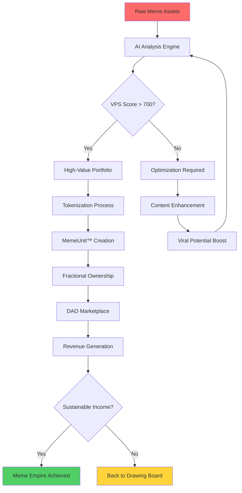
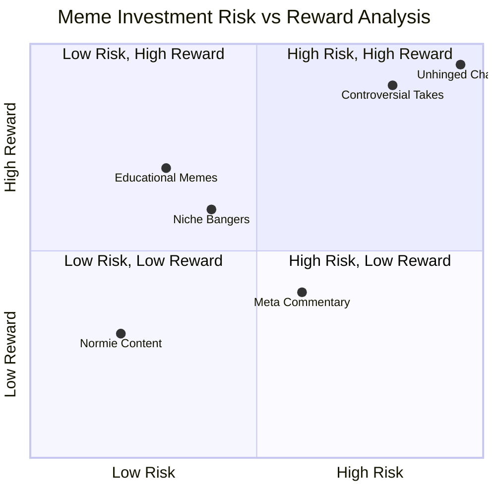

<Frame>
  
</Frame>

# 📊 How to Use AI to Model the Value of Your Meme Portfolio

<Note>
  🧠 **Let the Algo Decide if Your Sh\*tpost Has Alpha**

  Transform your digital chaos into quantified cultural equity with our revolutionary MemeForge™ AI system. Because your unhinged takes deserve proper valuation.
</Note>

## 🤔 Wait, Memes Have Portfolios?

**Old World™️ Assets (How Boring):**

- 💼 Property (tied to geography like some kind of peasant)
- 📈 Stocks (literally just gambling with extra steps)
- 💰 Fiat Currency (backed by... vibes?)

**Meme Economy™️ Assets (The Future is Now):**

<CodeGroup>

```bash Virality Velocity
How fast your meme spreads through the digital ecosystem
Measured in "shares per minute during peak cringe hours"
Higher velocity = Higher potential for exponential growth
```


```bash Niche Relatability
The precision of your cultural targeting algorithms
"It's giving very specific energy" conversion rates
Micro-communities pay premium for hyper-targeted content
```


```bash Derivative Potential
How remix-able and copy-pasta friendly your content is
Template scalability coefficient 
One good format = infinite variations = infinite value
```


```bash Time-to-Cancel Risk
The probability your meme gets you canceled within 48 hours
Calculated using our proprietary "Twitter Mob Prediction Engine"
High risk, high reward (or complete social exile)
```

</CodeGroup>

<Tip>
  **🏆 Congratulations\!** If you're sitting on a folder of spicy, unposted bangers — you're holding **unrealized cultural equity**. Time to liquidate that digital gold mine and make your parents proud (or deeply concerned).
</Tip>

---

## 🛠 Step 1: Feed the Memes to AlgoForge™

<Steps>
  <Step title="Upload Your Digital Assets">
    Drag and drop your meme stash into our AI-powered cultural analysis engine. Our servers are protected by military-grade encryption and existential dread.
  </Step>
  <Step title="Semantic DNA Analysis">
    Our algorithms decode the molecular structure of your humor using advanced machine learning trained on 4chan archives and TikTok comment sections.
  </Step>
  <Step title="Receive Your VPS Score">
    Get your personalized **Virality Probability Score** — it's like a credit rating, but for comedy. Range: 0-1000 (anything above 800 requires FBI monitoring).
  </Step>
</Steps>

### 🧬 What AlgoForge™ Analyzes (The Secret Sauce):

<AccordionGroup>
  <Accordion title="📊 Engagement Archaeology" icon="chart-line">
    We perform deep-dive forensic analysis of your digital footprint:

    - **Like-to-Screenshot Ratio**: The ultimate engagement metric
    - **Ghost Engagement Tracking**: People who save but don't interact (the purest form of validation)
    - **Hate-Share Coefficient**: Sometimes controversy = visibility = \$\$
    - **Mom-Safe Score**: Can you show this to your mother without therapy?

    Our AI even tracks **"cringe aging"** — how well your humor holds up over time. Some memes are fine wine, others are expired milk.
  </Accordion>
  <Accordion title="🧬 Semantic Meme DNA Sequencing" icon="dna">
    Our neural networks identify your meme's genetic makeup:

    - **Copy-Pasta Compatibility** (high reusability = high value)
    - **Ragebait Potential** (anger drives engagement, unfortunately)
    - **Irony Layers** (post-ironic content requires advanced degrees to understand)
    - **Authentically Unhinged Factor** (the rarest and most valuable category)

    We've categorized over 247 distinct meme subspecies, from "Basic Reaction GIF" to "Weaponized Absurdism."
  </Accordion>
  <Accordion title="❤️ Emotional Resonance Mapping" icon="heart">
    Advanced sentiment analysis trained on Gen Z dialects and emotional labor:

    - **"No Cap" Authenticity Levels**
    - **"Fr Fr" Sincerity Coefficients**
    - **Skull Emoji Decay Rates** (💀 vs 💀💀💀 exponential funniness scale)
    - **"I'm Deceased" Recovery Times**
    - **"This Sent Me" Distance Calculations**

    Our AI understands the subtle difference between "lmao" (mild amusement) and "LMAOOOOO" (genuine hysteria requiring medical attention).
  </Accordion>
</AccordionGroup>

<Warning>
  **⚠️ High Volatility Alert:** The spicier the meme, the higher the volatility. We're talking penny stocks energy, but with more existential dread and amphibian imagery. Invest responsibly (or don't, we're not your financial advisor).
</Warning>

---

## 💸 Step 2: Simulate ROI with Chaos Mathematics

### 🎰 The Monte Carlo Meme Simulator

<Info>
  **Philosophy:** Every meme is a probabilistic lottery ticket floating in the cosmic void of internet attention. We've built a quantum computer specifically to model this chaos.
</Info>

#### 📈 Revenue Stream Calculator (Where Dreams Meet Spreadsheets):

<Tabs>
  <Tab title="Direct Monetization">
    **The Obvious Money Moves:**

    - 💰 **Ad Revenue Split**: Platform-specific CPM calculations (Instagram pays in exposure, TikTok pays in anxiety)
    - 🛍️ **Merch Empire**: Print-on-demand comedy commodification ("My meme, your t-shirt, everyone's problem")
    - 📱 **OnlyFans Pipeline**: The controversial but statistically significant conversion funnel
    - 🎪 **Brand Partnerships**: Corporations desperately trying to seem "relatable" (they're not)
    - 💊 **Supplement Sponsorships**: Because every influencer sells gut health eventually

    **Expected ROI**: 2-15% (unless you go viral, then it's cocaine and Lamborghinis)
  </Tab>
  <Tab title="Indirect Value Creation">
    **The Long Game (For Strategic Thinkers):**

    - 🤝 **Network Effects**: Follower growth compounds like interest (but more unstable)
    - 📺 **Media Opportunities**: Podcasts, interviews, "expert commentary" on meme culture
    - 💼 **Career Capital**: "Internet Famous" looks great on LinkedIn (citation needed)
    - 🎭 **Social Status**: Intangible but valuable cultural cache in your friend group
    - 🏛️ **Speaking Engagements**: Universities pay people to explain TikTok trends now

    **Expected ROI**: 5-50% (depending on how well you can monetize your personal brand without selling your soul)
  </Tab>
  <Tab title="Meta-Economic Impact">
    **Galaxy Brain Strategies:**

    - 🧠 **Idea Arbitrage**: Mining your consciousness for scalable comedy content
    - 🔮 **Cultural Oracle Status**: Predicting trends before they happen (insider trading for memes)
    - 📚 **Educational Content**: Teaching others to meme (ultimate irony: commodifying creativity)
    - 🏛️ **Digital Anthropology**: Your contribution to humanity's cultural record
    - 🤖 **AI Training Data**: Future AIs will learn humor from your shitposts (immortality achieved)

    **Expected ROI**: -90% to 10,000% (this is where legends are born or bank accounts die)
  </Tab>
</Tabs>

### 🔥 The Risk-Reward Matrix

| **Meme Strategy**       | **Risk Level** | **Expected Returns** | **Cancellation Insurance** | **Parental Disappointment Factor** |
| ----------------------- | -------------- | -------------------- | -------------------------- | ---------------------------------- |
| **Normie Content**      | 🟢 Low         | 2-8%                 | ✅ Full Coverage            | 😌 Minimal                         |
| **Niche Bangers**       | 🟡 Medium      | 15-40%               | ⚠️ Partial Coverage        | 🤔 Confused Questions              |
| **Controversial Takes** | 🟠 High        | 50-500%              | ❌ You're On Your Own       | 😤 Active Intervention             |
| **Unhinged Chaos**      | 🔴 Extreme     | -100% to \+2000%     | 🤷‍♂️ Thoughts & Prayers   | 💀 Disowned                        |

---

## 🤝 Step 3: The Great Meme Financialization

<Note>
  **Welcome to the MemeDAO™ Financial District** — Where pixels meet profit margins and your childhood dreams of being a comedian finally pay rent.
</Note>

### 🪙 The Tokenization Process (Making It Rain Digital Assets):

<Steps>
  <Step title="Asset Curation">
    Select your top-performing memes based on VPS scores, engagement metrics, and pure gut feeling. Trust your instincts — they got you this far into the digital wasteland.
  </Step>
  <Step title="MemeUnit™ Conversion">
    Transform your content into tradeable **MemeUnits™** using our proprietary blockchain technology:

    - 1 MU = 1 Certified Banger
    - 0.5 MU = "It's Giving Effort"
    - 0.1 MU = "Mom Thought It Was Funny"
  </Step>
  <Step title="Fractional Ownership Launch">
    Split ownership like a REIT, but instead of boring real estate, it's your unhinged commentary on modern society. Investors can own 0.001% of your "This Is Fine" reaction to climate change.
  </Step>
  <Step title="DAO Integration & Market Listing">
    List on community cultural asset indexes and watch your digital labor finally generate passive income (or spectacular losses, we don't discriminate).
  </Step>
</Steps>

### 📊 The MemeForge™ Investment Pipeline



### 🎯 Risk Assessment Matrix



<CodeGroup>

```python Diversification Theory
# The "Don't Put All Your Eggs in One Basket" Approach
portfolio = {
    "safe_normie_content": 40,    # Your bread and butter
    "niche_specialist_humor": 30,  # Your competitive advantage  
    "experimental_chaos": 20,      # Innovation fund
    "controversy_reserve": 10      # Emergency attention fund
}
```


```javascript Risk Management
// Automated stop-loss triggers
const riskManagement = {
    cancelationRisk: "HIGH",
    actionPlan: [
        "Issue non-apology apology",
        "Disappear for 2-3 months", 
        "Return with 'personal growth' narrative",
        "Pivot to motivational content"
    ],
    recoveryTimeframe: "6-18 months"
}
```


```bash Liquidity Planning
# Converting cultural capital back to actual money
ENGAGEMENT_TO_USD_RATE=0.0001
VIRAL_MULTIPLIER=1000
BRAND_DEAL_CONVERSION=0.02

calculate_cashout_value() {
    return (followers * engagement_rate * brand_appeal) / existential_crisis_coefficient
}
```

</CodeGroup>

---

## 🧮 Emotional P&L Tracking (The Hidden Costs)

<Warning>
  **Critical Analysis Required:** Your sanity has a price, and we're legally obligated to help you calculate it. This is the most important section — ignore at your own psychological peril.
</Warning>

### 😵‍💫 The True Cost of Digital Fame:

<Tabs>
  <Tab title="Mental Health Depreciation">
    **The Psychological Balance Sheet:**

    - 📱 **Doomscroll Depreciation**: Hours consuming vs. creating content
    - 😴 **Sleep Debt Accumulation**: 3 AM posting schedules aren't sustainable
    - 🧠 **Attention Span Fragmentation**: Your ability to focus measured in TikTok units
    - 💭 **Intrusive Thought Monetization**: When your anxiety becomes content
    - 🔄 **Dopamine Resistance Building**: Requiring higher engagement for same satisfaction

    **Formula**: `(Screen Time × Mental Health Coefficient) ÷ Creative Output = Burnout Risk`
  </Tab>
  <Tab title="Social Capital Fluctuations">
    **Relationship Impact Assessment:**

    - 👥 **Friend Attrition Rate**: People you've lost to internet fame
    - 💔 **Family Confusion Index**: Explaining your "job" at dinner parties
    - 🏠 **Real World Re-entry Difficulty**: Going outside without filming it
    - 💬 **Conversation Quality Decline**: Everything becomes potential content
    - 🎭 **Authentic Self Erosion**: Who are you when the cameras are off?

    **Warning**: Some relationships are non-renewable resources. Choose your memes wisely.
  </Tab>
  <Tab title="Existential Crisis Management">
    **The Philosophy of Digital Validation:**

    - 🌀 **Meaning-Making Difficulty**: When your worth is measured in likes
    - 🤔 **Identity Crisis Frequency**: Are you your personal brand?
    - 💀 **Zero-Engagement Trauma**: "If a meme posts and no one engages, did I even exist?"
    - 🎪 **Imposter Syndrome Amplification**: You're just one ratio away from irrelevance
    - 🔮 **Future Self Disappointment**: Will 40-year-old you forgive your current choices?

    **Support Group**: Available Tuesdays, sponsored by therapy apps trying to seem cool.
  </Tab>
</Tabs>

### 📊 Emotional ROI Calculator:

```
Emotional Investment Assessment:

Time Invested: _____ hours/day
Sleep Sacrificed: _____ hours/night  
Relationships Strained: _____ people
Moments Lived vs. Documented: _____%
Self-Worth Tied to Metrics: _____%

TOTAL EMOTIONAL COST: Your results may vary (therapy recommended)
```

---

## 🚀 Ready to Revolutionize Your Digital Assets?

<Info>
  **The Bottom Line:** Your meme folder isn't digital hoarding — it's an underdeveloped asset portfolio waiting for proper financial engineering. You're basically sitting on oil reserves, but the oil is screenshots of Twitter drama.
</Info>

### 🎯 What You Get with MemeForge™ Pro:

<Tabs>
  <Tab title="AI Valuation Suite">
    **Let Algorithms Decode Your Humor DNA:**

    - Real-time VPS (Virality Probability Score) monitoring
    - Semantic analysis of your content's meme DNA
    - Predictive modeling for trend lifecycles
    - Automated risk assessment with cancellation probability
    - Cultural sentiment tracking across platforms

    _"Finally, a robot that understands my sense of humor better than my therapist."_
  </Tab>
  <Tab title="Portfolio Analytics Dashboard">
    **Track Your Cultural Investments Like Wall Street:**

    - Performance metrics that actually matter
    - Engagement ROI calculations with emotional cost adjustments
    - Diversification recommendations (don't put all your chaos in one platform)
    - Competitor analysis (what are other chronically online people doing?)
    - Market timing alerts for optimal posting windows

    _"I can finally explain to my parents what I do for a living (sort of)."_
  </Tab>
  <Tab title="Monetization Engine">
    **Turn Internet Points Into Actual Currency:**

    - Revenue stream optimization recommendations
    - Brand partnership matching (find companies desperate enough to sponsor you)
    - Audience demographic analysis for targeted monetization
    - Cross-platform syndication strategies
    - Exit strategy planning (when to cash out and touch grass)

    _"My student loans are finally afraid of me."_
  </Tab>
</Tabs>

### 🌟 Success Stories from the MemeForge™ Community:

<Tabs>
  <Tab title="Sarah, 24 - Professional Shitposter">
    _"I was just posting random thoughts at 2 AM. Now I'm a 'Thought Leadership Influencer' with a verified check and crippling impostor syndrome. MemeForge™ helped me quantify my chaos into a sustainable anxiety disorder with profit margins\!"_

    **Results:** 500K followers, \$50K/year in brand deals, mild existential crisis (manageable with therapy)
  </Tab>
  <Tab title="Marcus, 19 - Accidental Viral Sensation">
    _"One video of me crying about cryptocurrency turned into a multi-platform empire. I don't understand what happened, but MemeForge™'s analytics convinced my parents I'm not wasting my life (jury's still out on that one)."_

    **Results:** 2M TikTok followers, merchandise line, book deal, regular appearances on financial news (somehow)
  </Tab>
  <Tab title="Dr. Jennifer Chen, 34 - Academic Turned Meme Lord">
    _"I started making educational content about behavioral economics through memes. Now I'm more famous for my TikToks than my PhD. MemeForge™ helped me transition from tenure track to internet track without completely losing my dignity."_

    **Results:** 1.2M followers across platforms, consulting contracts, speaking fees, parents finally proud
  </Tab>
</Tabs>

---

## 💳 Pricing That Won't Break Your Ramen Budget

<Note>
  **Special Launch Offer:** We're disrupting the meme economy, so our prices are as volatile as cryptocurrency. Lock in these rates before we come to our senses.
</Note>

<Tabs>
  <Tab title="Starter Pack - 'Testing the Waters'">
    **\$19/month** (Less than your coffee addiction)

    ✅ Basic VPS scoring for up to 50 memes\
    ✅ Simple engagement analytics\
    ✅ Emotional cost warnings\
    ✅ Community access (depression shared is depression halved)\
    ✅ "Mom-safe" content filter

    _Perfect for: People who post occasionally and want to feel professional about it_
  </Tab>
  <Tab title="Pro Creator - 'Full Send Mode'">
    **\$79/month** (Investment in your digital empire)

    ✅ Everything in Starter Pack\
    ✅ Unlimited meme analysis\
    ✅ Advanced portfolio optimization\
    ✅ Brand partnership matching\
    ✅ Cross-platform analytics\
    ✅ Crisis management protocols\
    ✅ 24/7 AI coaching ("Post or don't post?" answered instantly)

    _Perfect for: Serious content creators who need to monetize their mental illness_
  </Tab>
  <Tab title="Enterprise - 'Meme Mogul'">
    **\$299/month** (For when you're basically running a media company)

    ✅ Everything in Pro Creator\
    ✅ White-label analytics for your team\
    ✅ Advanced predictive modeling\
    ✅ Direct line to trend forecasting AI\
    ✅ Legal risk assessment\
    ✅ Exit strategy consulting\
    ✅ Personal brand insurance (because you never know)

    _Perfect for: People who've accidentally built empires and need adult supervision_
  </Tab>
</Tabs>

---

## 🎉 Start Your Meme Empire Today

<Tip>
  **Ready to Transform Your Digital Chaos into Quantified Cashflow?**

  Your meme folder represents years of cultural labor, emotional investment, and questionable life choices. It's time to make those 3 AM posting sessions pay dividends.

  **Join thousands of creators who've gamified their creativity and monetized their existential dread.**
</Tip>

### 🚀 Get Started in 3 Steps:

1. **Sign up** at `fc.firuz-alimov.com` (our servers are powered by pure chaos energy)
2. **Upload** your meme portfolio (we promise our AI won't judge you... much)
3. **Watch** as your digital assets get professional valuations and monetization strategies

### 📞 Still Have Questions? (Of Course You Do)

<AccordionGroup>
  <Accordion title="Is this actually legal?" icon="scale">
    Surprisingly, yes\! We've consulted lawyers who specialize in "internet things" and they confirmed that monetizing your sense of humor is perfectly legal. Whether it's ethical is between you and your therapist.
  </Accordion>
  <Accordion title="What if my memes are actually terrible?" icon="trash">
    That's what we're here to determine\! Our AI has been trained on millions of terrible memes, so it's an expert in distinguishing between "so bad it's good" and "just bad." We'll help you optimize your terrible into profitable terrible.
  </Accordion>
  <Accordion title="Will this affect my relationships?" icon="users">
    Probably, but not necessarily in a bad way\! Some users report that their friends now respect them more as "entrepreneurs," while others find that monetizing their humor makes family gatherings even more awkward than before.
  </Accordion>
  <Accordion title="What's the refund policy?" icon="credit-card">
    If you're not satisfied within 30 days, we'll refund your money and delete all evidence that you tried to commercialize your memes. We understand that some people need to maintain the illusion of artistic integrity.
  </Accordion>
</AccordionGroup>

---

<Warning>
  **Final Disclaimer:** This platform is designed for entertainment and educational purposes, with a light seasoning of actual utility. We're not responsible for: existential crises arising from quantifying your humor, relationship damage from treating memes as investments, or the gradual erosion of your authentic self in pursuit of engagement metrics.

  **Side Effects May Include:** Increased screen time, decreased real-world social skills, obsession with analytics, tendency to view all life experiences as potential content, and the gradual realization that we've commodified human creativity. Please meme responsibly.

  **Results Not Guaranteed:** Past meme performance does not indicate future cultural relevance. The internet is fickle, algorithms are mysterious, and sometimes good content gets zero engagement while terrible content goes viral. Such is life in the digital age.
</Warning>

---

_Built with questionable ethics and excessive caffeine by people who've spent too much time online. Copyright © 2025 MemeForge™ Industries. All rights reserved, including the right to be deeply concerned about what we've created._