<Frame>
  
</Frame>

# 🧬 How to Use the Life Plan Calculator to Break the Matrix

<Warning>
  **⚠️ EXISTENTIAL HAZARD WARNING**: This guide may cause sudden clarity about life priorities, uncontrollable urge to update LinkedIn status to "It's Complicated," and mysterious ability to see through corporate buzzwords. Proceed with caution.
</Warning>

> **Model your ideal life. Run alternate simulations. Then actually go build it.**
>
> _Or continue scrolling TikTok in your beige cubicle. Your choice, Neo._

---

## 🧠 Wait, You Don't Have a Spreadsheet for Your Soul?

```mermaid
flowchart TD
    A[👤 Average Human] --> B{Has Retirement Account?}
    B -->|Yes| C[✅ Financially Responsible Adult]
    B -->|No| D[😱 Living Paycheck to Paycheck]
    
    C --> E{Has Life Plan Spreadsheet?}
    D --> E
    
    E -->|Yes| F[🦄 Mythical Creature - You Are 0.01% of Population]
    E -->|No| G[🐑 Default Mode: Following Someone Else's Script]
    
    G --> H[📊 Time to Build Your Life Dashboard]
    F --> I[🚀 Time to Optimize and Break Reality]
    
    style F fill:#ff9999
    style H fill:#99ff99
    style I fill:#9999ff
```



**The Statistical Reality Check:**

- 📈 87% of humans have a retirement account
- 💭 12% have actually calculated their "life account"
- 🦄 0.3% have dared to simulate ditching corporate life at 29 for that Kombucha-Metaverse startup in Oaxaca
- 🤯 0.01% are reading this guide and about to join the simulation revolution

<Info>
  **Welcome to the Life Plan Calculator**: Where your dreams get a balance sheet — and then a battle plan. Think of it as **The Sims** for your actual existence, but with real financial consequences and significantly fewer pixelated furniture disappointments.
</Info>

---

## 🚪 Step 1: Red Pill Moment – Enter Your Default Life Path

<Note>
  **Neo's Choice Moment**: You're about to see how deep the rabbit hole of your current life trajectory actually goes. Spoiler: It's probably deeper and more beige than you expected.
</Note>

### 🌐 Access the Matrix Portal

Head to **`fc.firuz-alimov.com`** and fire up the **Life Plan Calculator**.

<Tip>
  If the site is down, that's probably just the simulation glitching. Try refreshing your browser, your existence, or both simultaneously.
</Tip>

### 📊 Input Your Current Reality Parameters

<AccordionGroup>
  <Accordion title="🎂 Current Age (Your Biological Timestamp)" icon="cake">
    Enter your chronological age. Mental age is optional but recommended for accuracy.

    **Pro Tip**: If you're still buying cereal based on the toy inside, your mental age might be significantly different from your biological age. The calculator accounts for this existential gap.

    **Age Bracket Analysis**:

    - 20-25: Peak optimism, minimum life experience
    - 26-35: Dawning realization that adulting is a scam
    - 36-45: Midlife recalibration phase (crisis optional)
    - 45\+: Zero effs given, maximum wisdom achieved
  </Accordion>
  <Accordion title="⏰ Expected Work Years (Hamster Wheel Duration)" icon="clock">
    How long until you escape the corporate matrix? Be brutally honest, not hopefully delusional.

    ```mermaid
    gantt
        title Your Work Life Timeline
        dateFormat  YYYY
        section Traditional Path
        Soul Crushing Job    :active, 2025, 2065
        Retirement Bliss     :2065, 2085
        section Alternative Path
        Creative Freedom     :active, 2025, 2055
        Passive Income Life  :2055, 2085
    ```

    **Reality Check**: The average American works 47 years. The average human lifespan is 78 years. Do the math. Cry a little. Then optimize.
  </Accordion>
  <Accordion title="💰 Yearly Income (Dreams vs Reality Reconciliation)" icon="dollar-sign">
    Input your actual income, not what you tell people at high school reunions.

    **Income Categories Translated**:

    - **"Startup Salary"**: Equity-heavy, cash-light, hope-maximum
    - **"Corporate Salary"**: Steady paycheck, soul-crushing meetings, golden handcuffs
    - **"Freelancer Income"**: Feast-or-famine lifestyle, Tuesday millionaire, Wednesday ramen
    - **"Passive Income"**: The holy grail, probably involving cryptocurrency and/or dropshipping courses

    <Warning>
      **Honesty Required**: The algorithm can detect when you're inflating numbers to feel better about your choices. It's judgmental like that.
    </Warning>
  </Accordion>
  <Accordion title="💸 Monthly Expenses (The Reality Audit)" icon="credit-card">
    Time for the most brutal self-assessment you'll do today:

    **Essential Expenses** (Non-negotiable adult tax):

    - 🏠 **Housing**: Rent, mortgage, or parents' basement guilt payments
    - 🍕 **Food**: Groceries \+ delivery apps that know you better than your therapist
    - 🚗 **Transportation**: Car payments, gas, Uber addiction, public transit dignity loss
    - 📱 **Utilities**: Internet, phone, streaming services (Netflix, Disney\+, that weird niche anime platform)

    **Educational PTSD Installments**:

    - 🎓 **Student Loans**: Monthly reminders of that Philosophy degree's ROI
    - 📚 **Continuing Education**: MasterClasses you'll never finish, coding bootcamps, pottery classes

    **Lifestyle Inflation Categories**:

    - ☕ **Coffee Industrial Complex**: \$6 lattes × 365 days = existential crisis
    - 🛍️ **Retail Therapy**: Amazon Prime's psychological grip on your wallet
    - 🍷 **Social Lubrication**: Drinks, dinners, "networking" events
    - 💊 **Mental Health Maintenance**: Therapy, meditation apps, supplements for anxiety about everything

    **Secret Shame Expenses**:

    - 💎 **Crypto Gambling**: Diamond hands, paper wallet, emotional rollercoaster
    - 🎮 **Digital Escapism**: Gaming, in-app purchases, virtual reality addiction
    - 🧘 **Self-Improvement Rabbit Holes**: Seminars, books, courses promising to unlock your potential

    <Note>
      **Pro Insight**: The average millennial spends $1,497/month on non-essential purchases. That's $17,964/year. That's also a down payment on a house, a year in Bali, or seed funding for your weird business idea.
    </Note>
  </Accordion>
  <Accordion title="🎯 Desired Lifestyle Metrics (Soul Nourishment Requirements)" icon="target">
    What actually makes your existence worthwhile? Let's quantify the unquantifiable:

    **Adventure Quotient**:

    - 🌍 **Travel Frequency**: Instagram-worthy locations per year
    - 🗺️ **Exploration Budget**: How much wanderlust costs annually
    - 📸 **Memory Creation**: Experiences that'll matter on your deathbed

    **Intellectual Stimulation Index**:

    - 📚 **Learning Investments**: MasterClasses you'll actually finish (optimistic)
    - 🎨 **Creative Expression**: Novel writing, podcast production, interpretive dance career
    - 🔬 **Curiosity Funding**: Weird hobbies, experimental projects, passion pursuits

    **Human Connection Matrix**:

    - 👨‍👩‍👧‍👦 **Family Time**: Quality over quantity (hopefully)
    - 🍻 **Friend Maintenance**: Social life that doesn't revolve around work complaints
    - ❤️ **Romantic Investment**: Date nights, relationship building, not just Netflix and complaining

    **Purpose Alignment Score**:

    - 🌱 **Impact Creation**: Making the world slightly less terrible
    - 🎯 **Mission Clarity**: Knowing why you get up each morning
    - 🏆 **Legacy Building**: What you want to be remembered for (besides your memes)
  </Accordion>
</AccordionGroup>

<Info>
  **🎭 This is your base simulation** — aka "the LinkedIn path" or "what your parents think success looks like" or "the socially acceptable way to spend your finite existence on this spinning rock."
</Info>

---

## 🌀 Step 2: Create Your Parallel Lives (The Multiverse Unleashed)

Now we build the **gloriously weird alternatives**. Time to channel your inner multiverse architect and give your spreadsheet some personality disorders:

```mermaid
flowchart TD
    A[👤 Current You] --> B[🌟 Multiverse Portal]
    
    B --> C[🟣 Scenario A: Bali Frog Farmer]
    B --> D[🟢 Scenario B: AI Meme Lord]  
    B --> E[🔵 Scenario C: Raw Vegan Dating Disruptor]
    B --> F[🟡 Scenario D: Your Custom Madness]
    
    C --> G[🐸 Amphibian Empire Builder]
    D --> H[🤖 Digital Comedy Overlord]
    E --> I[🥬 Chlorophyll Cupid]
    F --> J[🌈 Infinite Possibilities]
    
    style A fill:#cccccc
    style B fill:#ff6b6b
    style C fill:#9b59b6
    style D fill:#2ecc71
    style E fill:#3498db
    style F fill:#f39c12
```



<AccordionGroup>
  <Accordion title="🟣 Scenario A: The Bali Frog Farmer Renaissance" icon="frog">
    **"I quit at 35 and start a frog farm in Bali"**

    <Warning>
      **Amphibian Alert**: This scenario requires advanced patience, questionable business sense, and the ability to find spiritual meaning in croaking sounds.
    </Warning>
    **Revenue Stream Breakdown**:

    - 🐸 **Frog Export Revenue**: \$2,400/month (surprisingly lucrative niche market)
    - 🧘 **Meditation Retreat Side Hustle**: \$800/month (teaching zen through amphibian observation)
    - 📺 **YouTube Channel "Hopeful Mornings"**: \$300/month (daily frog wisdom \+ sunrise shots)
    - 🎭 **Frog-Themed Merch Empire**: \$200/month (t-shirts, calendars, motivational posters)

    **Lifestyle Modifications**:

    - 🏡 **Housing**: Bamboo villa rental (\$400/month) with built-in frog sanctuary
    - 🛵 **Transportation**: Motorbike \+ occasional helicopter (for dramatic exits)
    - 🤝 **Networking**: Amphibian enthusiast meetups, permaculture conferences, spiritual retreats
    - 😌 **Stress Level**: Significantly reduced (frogs are inherently zen, science confirms this)
    - 🌅 **Daily Routine**: 5 AM meditation, frog feeding, content creation, afternoon naps

    **Hidden Costs**:

    - Visa complications, tropical disease prevention, internet reliability therapy

    **Success Probability**: 73% (surprisingly high due to niche market demand)
  </Accordion>
  <Accordion title="🟢 Scenario B: The Nomadic AI Meme Strategist" icon="robot">
    **"I live nomadically on \$1,800/mo running AI meme consultancies"**

    <Note>
      **Digital Nomad Reality Check**: This path requires advanced internet addiction, questionable sleep schedules, and the ability to explain why your job matters to confused relatives at Thanksgiving.
    </Note>
    **Revenue Stream Portfolio**:

    - 🤖 **AI Meme Strategy Consulting**: \$1,200/month (Fortune 500 companies surprisingly need this)
    - 🎨 **NFT Comedy Specials**: \$400/month (blockchain meets stand-up comedy)
    - 📱 **Sponsored TikToks About Existential Dread**: \$200/month (Gen Z's favorite content)
    - 💬 **Corporate Humor Workshops**: \$300/month (teaching middle management to be funny)

    **Nomad Economics Masterclass**:

    - 🏠 **Accommodation**: Airbnb arbitrage mastery, house-sitting network, strategic couch surfing
    - 🍜 **Food Budget**: Street food PhD program, local market navigation, occasional food poisoning
    - 💻 **Equipment**: One laptop, noise-canceling headphones, portable WiFi hotspot, backup power bank
    - 🏥 **Healthcare**: Crossing fingers \+ comprehensive travel insurance \+ Google translate medical app

    **Geographic Optimization**:

    - Q1: Thailand (low cost, fast internet, amazing food)
    - Q2: Mexico (time zone alignment, cultural immersion, taco research)
    - Q3: Portugal (EU base, digital nomad visa, pastel de nata addiction)
    - Q4: Bali (spiritual reset, Instagram content, volcano backdrop meetings)

    **Success Probability**: 89% (high demand, low overhead, scalable absurdity)
  </Accordion>
  <Accordion title="🔵 Scenario C: The Raw Vegan Dating Revolutionary" icon="carrot">
    **"I launch a weird dating app for people who only eat raw vegetables and pitch it to SoftBank"**

    <Info>
      **Market Research Revelation**: This demographic actually exists, they're surprisingly passionate about chlorophyll compatibility, and they have disposable income from not spending money on cooking equipment.
    </Info>
    **Startup Financial Breakdown**:

    _Initial Investment Requirements_:

    - 💻 **App Development**: \$15,000 (React Native, matching algorithms, carrot emoji integration)
    - ⚖️ **Legal Fees**: \$5,000 (terms of service, privacy policy, vegetable discrimination lawsuits)
    - 📢 **Marketing to Veggie Influencers**: \$3,000 (micro-influencer campaigns, kale-fluencer partnerships)
    - 🏢 **Office Space**: \$0 (WeWork hot desk, local juice bar meetings, park bench pitches)

    _Revenue Projections_:

    - 💰 **Freemium Model**: \$5/month premium features (chlorophyll level matching, compost compatibility scores)
    - 🎁 **Partnership Revenue**: Raw food delivery services, vitamin subscriptions, spirulina suppliers
    - 📊 **Data Monetization**: Vegetable preference analytics (ethically sourced, obviously)

    **Potential Outcome Scenarios**:

    - 🎯 **Best Case**: \$50M Series A from health-obsessed VCs, TED talk about "love in the age of vegetables"
    - 📰 **Likely Case**: Featured on TechCrunch's "WTF Startups" section, viral Twitter memes, podcast appearances
    - 😅 **Worst Case**: Great dinner party story, niche following, pivot to general wellness app

    **Personal Transformation Requirements**:

    - 🥗 **Dietary Conversion**: Mandatory raw veganism (your users will fact-check your Instagram)
    - 👥 **Social Circle Shift**: Extremely niche but surprisingly passionate community
    - 💕 **Dating Pool**: Ironically limited to your own app users (the ultimate dogfooding)

    **Success Probability**: 34% (niche market, high passion, questionable scalability)
  </Accordion>
  <Accordion title="🟡 Design Your Own Reality Hack" icon="wand-magic-sparkles">
    **"I become [YOUR WILDEST PROFESSIONAL FANTASY HERE]"**

    <Tip>
      **Creative Prompts for Maximum Absurdity**:

      - Professional Netflix category creator
      - Artisanal ice cube sommelier for high-end cocktail bars
      - Corporate meditation guru who only works with tech startups
      - Full-time treasure hunter with modern marketing strategies
      - Custom playlist curator for people's life transitions
      - Professional third wheel for awkward couples
      - Micro-influencer for extremely specific household appliances
    </Tip>
    **Template for Scenario Building**:

    1. **Core Activity**: What bizarre thing becomes your main income source?
    2. **Revenue Streams**: How do you monetize the absurd? (minimum 3 income sources)
    3. **Lifestyle Changes**: What does your daily routine look like?
    4. **Geographic Requirements**: Where in the world does this make sense?
    5. **Skill Acquisition**: What do you need to learn to make this work?
    6. **Success Metrics**: How do you measure victory in this weird new world?

    **Advanced Variables to Adjust**:

    - **Risk Tolerance**: Conservative investor → YOLO crypto maximalist
    - **Social Status**: Climbing corporate ladder → Creating your own weird ladder
    - **Work Schedule**: 9-to-5 prisoner → Master of your own temporal destiny
    - **Geographic Freedom**: Cubicle-bound → Location-independent reality architect
  </Accordion>
</AccordionGroup>

<Note>
  **🎭 Multiverse Achievement Unlocked**: You just became your own parallel universe generator. Neo wishes he had this much choice architecture.
</Note>

---

## 📊 Step 3: Compare, Contrast, Contemplate Your Mortality

<Warning>
  **Emotional Preparation Required**: The following analysis may cause sudden clarity about life priorities, uncontrollable urge to email your resignation, and temporary inability to care about quarterly reports.
</Warning>

### 🔍 The Great Life Audit Dashboard


**What the Calculator Reveals** (Prepare for existential whiplash):

**💸 Financial Freedom Velocity Analysis**:

- Which life plan gives you **freedom fastest** (spoiler: probably not the corporate hamster wheel)
- At what point passive income or creativity **outpaces traditional salary** (plot twist incoming)
- How much your happiness actually **costs to sustain** (might be less than your current Starbucks budget)
- The exact moment your soul becomes non-negotiable

**⚡ The Sacred Life ROI Formula**:

```
IRR of Life = (Joy × Meaning × Freedom) ÷ (Time × Stress × Regret)

Where:
Joy = Meaningful experiences + Creative fulfillment + Daily satisfaction
Meaning = Impact creation + Purpose alignment + Legacy building  
Freedom = Financial independence + Geographic mobility + Schedule autonomy
Time = Years not spent in existential dread + Hours of conscious living
Stress = Anxiety levels + Work pressure + Financial worry
Regret = "What if" scenarios + Unfulfilled potential + Deathbed disappointments
```

**🎯 Comparative Life Analysis Output**:

<AccordionGroup>
  <Accordion title="📈 Financial Trajectory Comparison" icon="chart-line">
    **Traditional Path vs. Alternative Realities**:

    - **Corporate Ladder Climb**: Steady income, predictable growth, soul slowly dying
    - **Creative Entrepreneurship**: Volatile income, unlimited upside, existential satisfaction
    - **Geographic Arbitrage**: Lower costs, lifestyle inflation, experience richness
    - **Passion Monetization**: Purpose alignment, market uncertainty, intrinsic motivation

    **Break-Even Analysis**:

    - When does Alternative Path A reach financial parity with Traditional Path?
    - What's the happiness premium worth in actual dollars?
    - How much would you pay to never attend another pointless meeting?
  </Accordion>
  <Accordion title="🧘 Lifestyle Quality Metrics" icon="heart">
    **The Stuff That Actually Matters Dashboard**:

    - **Daily Joy Minutes**: Tracked like screen time, optimized like a growth hacker
    - **Stress Biomarkers**: Cortisol levels, Sunday Scaries intensity, meeting-induced anxiety
    - **Creative Expression Quotient**: How much of your authentic self shows up in your work
    - **Relationship Quality Index**: Time spent with humans you actually like
    - **Adventure Accumulation**: Stories you'll tell on your deathbed vs. spreadsheets you'll forget

    **Life Satisfaction Scoring**:

    - Morning excitement level (1-10): Do you wake up energized or already defeated?
    - Evening reflection quality: Proud of the day or wondering where time went?
    - Weekend recovery requirements: Fun adventures or just sleeping off work trauma?
  </Accordion>
  <Accordion title="⏰ Time Freedom Analysis" icon="clock">
    **The Ultimate Non-Renewable Resource Audit**:

    ```mermaid
    gantt
        title Your Weekly Time Allocation
        dateFormat  YYYY-MM-DD
        section Current Reality
        Work + Commute     :2025-01-01, 50h
        Sleep             :2025-01-01, 56h
        Life Admin        :2025-01-01, 10h
        Actually Living   :2025-01-01, 52h
        section Alternative Reality  
        Meaningful Work   :2025-01-01, 30h
        Sleep             :2025-01-01, 56h
        Life Admin        :2025-01-01, 5h
        Actually Living   :2025-01-01, 77h
    ```

    **Time Sovereignty Calculation**:

    - Hours per week under someone else's control
    - Percentage of waking hours spent on your own priorities
    - Years until you can do whatever you want whenever you want
    - Cost of buying back your time (hourly rate vs. freedom price)
  </Accordion>
</AccordionGroup>

<Info>
  **Reality Check**: This isn't just a spreadsheet — it's **a portal** to parallel dimensions where you made different choices. Some dimensions have better coffee. Others have more meaning. A few have both.
</Info>

---

## 🛠 Bonus Features: "Matrix Breaker" Mode

<Warning>
  **Advanced User Warning**: The following features may cause complete paradigm shifts, uncontrollable clarity about life purpose, and inability to participate in small talk about weather.
</Warning>

<AccordionGroup>
  <Accordion title="🎯 Purpose Alignment Score (The Soul GPS)" icon="bullseye">
    **The Ultimate Question**: Are you building your own legacy or just optimizing KPIs for someone else's dream?

    This feature calculates the distance between your current activities and your actual values. Think of it as GPS for your soul, but with more existential crisis and less "recalculating route."

    **Scoring Methodology**:

    - **Daily Activity Audit**: What percentage of your time aligns with your stated values?
    - **Impact Measurement**: Are you making the world better or just making your boss richer?
    - **Authenticity Index**: How much of your real personality shows up at work?
    - **Legacy Trajectory**: What story will your life tell when you're gone?

    **Score Interpretation**:

    - **90-100**: You're basically Gandhi with better Wi-Fi and modern marketing
    - **70-89**: Decent human doing meaningful work, probably sustainable long-term
    - **50-69**: Corporate zombie with occasional pulse, still time to course-correct
    - **30-49**: Soul slowly evacuating premises, urgent intervention required
    - **Below 30**: Existential emergency, vision quest immediately recommended

    **Remedial Actions by Score Range**:

    - High scores: Optimize and scale your impact
    - Medium scores: Identify misalignment points and adjust
    - Low scores: Complete life restructuring or therapy (possibly both)
  </Accordion>
  <Accordion title="🧘 Emotional Burn Rate Calculator" icon="fire">
    **Critical Life Metric**: How fast does your soul evaporate under current conditions?

    <Note>
      **Scientific Basis**: Longitudinal studies show that chronic misalignment between values and daily activities leads to measurable decreases in life satisfaction, creativity, and ability to find joy in simple pleasures.
    </Note>
    **Burn Rate Variables**:

    - **Micromanagement Exposure**: Frequency of unnecessary oversight and control
    - **Pointless Meeting Density**: Hours per week in discussions that could be emails
    - **Buzzword Toxicity Levels**: Corporate speak concentration in daily communication
    - **Creative Suppression Index**: Gap between your ideas and what you're allowed to implement
    - **Dreams-Per-Day Degradation**: Rate at which you stop believing in possibilities

    **Danger Level Assessment**:

    - 🟢 **Green Zone (Sustainable)**: Can continue indefinitely without psychological damage
    - 🟡 **Yellow Zone (Caution)**: 2-3 years before creativity death, intervention helpful
    - 🔴 **Red Zone (Danger)**: Currently googling "how to become a park ranger" during lunch breaks
    - ⚫ **Black Zone (Emergency)**: Already updating resume in bathroom stalls, exit strategy critical

    **Recovery Protocols by Zone**:

    - Green: Maintain course, optimize for growth
    - Yellow: Introduce creative outlets, plan transition timeline
    - Red: Immediate lifestyle changes, professional development pivot
    - Black: Emergency extraction, soul CPR, complete environment change
  </Accordion>
  <Accordion title="🔁 Phoenix Rising Scenarios (Rebirth Analytics)" icon="phoenix">
    **Life Plot Twist Modeling**: What happens if you completely restart at different life stages?

    ```mermaid
    timeline
        title Life Restart Scenarios
        section Age 30 Pivot
          Quarter-Life Clarity    : Energy High
                                 : Debt Manageable  
                                 : Options Unlimited
                                 : Fear Minimal
        section Age 40 Renaissance  
          Midlife Wisdom         : Experience Rich
                                : Resources Accumulated
                                : Risk Tolerance Variable
                                : Time Pressure Medium
        section Age 50 Revolution
          Zero Effs Given        : Authenticity Maximum
                                : Health Awareness Peak
                                : Financial Stability Possible
                                : Legacy Focus Activated
    ```

    **Age-Specific Restart Advantages**:

    **🎂 The 35-Year Strategic Pivot**:

    - ✅ **Advantages**: Peak energy \+ some experience, manageable financial obligations, network established
    - ⚠️ **Challenges**: Career momentum to abandon, lifestyle inflation to reverse, social expectations to ignore
    - 🎯 **Optimal Strategies**: Skills transfer, geographic arbitrage, passion project scaling
    - 📊 **Success Probability**: 78% (sweet spot of capability and opportunity)

    **🎉 The 45-Year Renaissance Launch**:

    - ✅ **Advantages**: Accumulated wisdom, financial cushion possible, clarity about what matters
    - ⚠️ **Challenges**: Energy levels declining, mortgage anxiety maximum, family obligations peak
    - 🎯 **Optimal Strategies**: Consulting transition, expertise monetization, lifestyle business creation
    - 📊 **Success Probability**: 65% (wisdom overcomes energy decline if planned well)

    **🚀 The 55-Year Freedom Declaration**:

    - ✅ **Advantages**: Zero effs given attitude, health consciousness activated, time urgency clarifying
    - ⚠️ **Challenges**: Ageism in some industries, health considerations, retirement timeline pressure
    - 🎯 **Optimal Strategies**: Mentorship roles, creative expression, impact-focused ventures
    - 📊 **Success Probability**: 89% (highest success rate due to clarity and authenticity)

    **💔 The Post-Major-Life-Event Restart**:

    - **Divorce Liberation**: Assets divided but spirit undivided, terrifying freedom, mandatory self-discovery
    - **Career Destruction**: Industry obsolescence, company closure, getting fired for speaking truth
    - **Health Awakening**: Medical scare, burnout recovery, mortality reality check
    - **Inheritance Windfall**: Sudden financial freedom, obligation to honor legacy, unlimited possibilities

    **Restart Success Factors** (Universal across ages):

    1. **Clarity of Vision**: Know what you're moving toward, not just what you're escaping
    2. **Financial Runway**: Calculate minimum survival time, build buffer for transition period
    3. **Support Network**: Surround yourself with people who believe in your weirdness
    4. **Skill Transferability**: Identify what you're good at that works anywhere
    5. **Risk Management**: Plan for failure scenarios, have multiple backup plans
    6. **Authenticity Commitment**: Promise to never again live someone else's definition of success
  </Accordion>
</AccordionGroup>

---

## 🧪 What You Actually Learn (The Uncomfortable Truths)

<Warning>
  **Philosophical Side Effects**: The following insights may permanently alter your relationship with conventional life advice, career counselors, and anyone who asks "what do you do for work?"
</Warning>

### 🏗️ Your Life is an Asset Class (Portfolio Theory for Humans)

<AccordionGroup>
  <Accordion title="💼 Life Portfolio Diversification Strategy" icon="briefcase">
    Just like financial portfolios, your life benefits from diversification across multiple areas:

    **Income Stream Diversification**:

    - Traditional employment (stability asset)
    - Creative projects (growth asset)
    - Passive income (dividend asset)
    - Skill monetization (appreciation asset)
    - Relationship capital (insurance asset)

    **Geographic Diversification**:

    - Home base (stability)
    - Adventure locations (growth)
    - Low-cost arbitrage areas (efficiency)
    - Network expansion territories (opportunity)

    **Temporal Diversification**:

    - Short-term survival needs
    - Medium-term growth investments
    - Long-term legacy building
    - Emergency pivot capabilities

    <Tip>
      **Portfolio Rebalancing**: Just as financial portfolios need periodic rebalancing, your life portfolio benefits from regular assessment and adjustment. The 30s focus might be skill building, 40s might emphasize financial accumulation, 50s\+ might pivot to impact and meaning.
    </Tip>
  </Accordion>
  <Accordion title="🔬 Planning is Just Sophisticated Prototyping" icon="flask">
    Every scenario you run is a prototype of a potential future self. The goal isn't to predict the future perfectly—it's to build your pattern recognition for what works and what doesn't.

    **Prototype Categories**:

    - **Elegant Solutions**: High satisfaction, sustainable, scalable
    - **Noble Failures**: High meaning, unsustainable economics, learning rich
    - **Catastrophic Failures**: Low satisfaction, unsustainable, valuable negative data
    - **Unexpected Successes**: Accidental discoveries that exceed expectations

    **Rapid Prototyping for Life Decisions**:

    1. **Mini-Experiments**: Try components of major changes (freelance on weekends, take extended trips, start side projects)
    2. **Reversible Decisions**: Structure major changes so they can be undone if needed
    3. **Iterative Improvement**: Make small adjustments based on real-world feedback
    4. **Fail-Fast Learning**: Identify what doesn't work quickly and cheaply

    <Info>
      **Designer Thinking for Life**: Approach your life like a product designer approaches user experience. Test assumptions, gather feedback, iterate based on results, and always keep the end user (future you) in mind.
    </Info>
  </Accordion>
  <Accordion title="🔓 The Matrix is Mostly Spreadsheets and Fear" icon="lock-open">
    The system keeping everyone trapped isn't some elaborate conspiracy. It's mostly held together by **default Excel tabs and fear of health insurance premiums**.

    **Matrix Construction Materials**:

    - **Default Settings**: Most people never change the default options on anything
    - **Social Expectations**: Fear of disappointing people who might not even care
    - **Financial Anxiety**: Overestimating costs, underestimating adaptability
    - **Status Preservation**: Protecting identity investments that no longer serve
    - **Comfort Zone Gravity**: The psychological pull of familiar misery over unknown possibility

    **Matrix Exit Strategies**:

    1. **Question Default Assumptions**: What if the "safe" path is actually the risky one?
    2. **Calculate Opportunity Costs**: What are you not doing because of what you are doing?
    3. **Model Alternative Economics**: Run the numbers on different lifestyle approaches
    4. **Build Transition Bridges**: Create pathways that reduce binary choice anxiety
    5. **Find Your Tribe**: Connect with people living alternatives that inspire you

    <Note>
      **The Liberation Reality**: Once you model the alternatives with actual numbers, the cage door reveals itself to have been unlocked the whole time. Most constraints are voluntary agreements with systems that profit from your compliance.
    </Note>
  </Accordion>
  <Accordion title="🎭 Identity vs. Activity Separation" icon="masks-theater">
    **The Dangerous Fusion**: When your identity becomes inseparable from your job title, changing careers feels like psychological death.

    **Identity Architecture Redesign**:

    - **Core Values**: What matters regardless of your paycheck source?
    - **Transferable Skills**: What can you do that works in multiple contexts?
    - **Personal Mission**: What impact do you want to have on the world?
    - **Relationship Roles**: Who are you to the people who matter most?
    - **Creative Expression**: How does your authentic self show up in the world?

    **Professional vs. Personal Identity Matrix**:

    ```mermaid
    quadrantChart
        title Identity Dependency Assessment
        x-axis Low Identity Fusion --> High Identity Fusion
        y-axis Low Job Satisfaction --> High Job Satisfaction
        quadrant-1 Golden Handcuffs Zone
        quadrant-2 Sustainable Sweet Spot
        quadrant-3 Miserable but Flexible
        quadrant-4 Trapped and Suffering
    ```

    **Recovery Protocol for Over-Identification**:

    1. **Diversify Identity Sources**: Develop roles and skills outside of work
    2. **Practice Introduction Variations**: Describe yourself without mentioning your job
    3. **Cultivate Transferable Expertise**: Build skills that work across industries
    4. **Maintain Outside Relationships**: Nurture friendships based on shared interests, not professional networking
    5. **Regular Identity Audits**: Check if your sense of self still aligns with your current activities
  </Accordion>
</AccordionGroup>

### 🧭 The Navigation Paradox (Choice Architecture for Humans)

**The Modern Dilemma**: We have more life options than any generation in history, but most people still follow remarkably similar scripts. Why?

**Choice Overwhelm Solutions**:

- **Constraint as Liberation**: Artificial limitations that force creative solutions
- **Sequential Decision Making**: One major change at a time, building momentum
- **Reversible Experiments**: Lower-stakes ways to test major life changes
- **Peer Group Diversification**: Expose yourself to people living differently successful lives

**The Calculator's Hidden Gift**: It doesn't just show you options—it reveals the hidden assumptions you've been making about what's "reasonable" or "possible."

---

## 🚀 Take Action: Go Simulate Your Freedom

<Warning>
  **Implementation Alert**: Reading about life optimization without taking action is just sophisticated procrastination with better vocabulary.
</Warning>

### 🎯 Your Mission (Should You Choose to Accept It)

<AccordionGroup>
  <Accordion title="🔥 Immediate Actions (Next 24 Hours)" icon="zap">
    **The Momentum Builders**:

    1. **🌐 Access the Portal**: Go to `fc.firuz-alimov.com` and create your baseline scenario
    2. **📊 Brutal Honesty Audit**: Input your real numbers, not the ones that make you feel better
    3. **🎭 Create One Wild Alternative**: Model your most exciting "what if" scenario
    4. **📱 Screenshot the Results**: Save evidence of your courage to imagine differently
    5. **💬 Share Your Weirdest Scenario**: Post it somewhere public (accountability magic)

    **Resistance Management**:

    - When your brain says "this is silly," remind it that most breakthrough decisions looked silly at first
    - When anxiety kicks in, remember you're just modeling, not committing
    - When impostor syndrome appears, note that everyone else is also making it up as they go
  </Accordion>
  <Accordion title="📈 Week One Deep Dive" icon="calendar">
    **The Foundation Building Phase**:

    **Days 1-2: Reality Documentation**

    - Track your actual time usage (prepare for horror/enlightenment)
    - Document your real expenses (every coffee, every subscription, every impulse purchase)
    - Rate your daily satisfaction levels (1-10 scale, be ruthlessly honest)

    **Days 3-4: Alternative Universe Construction**

    - Build 3 different scenarios using the calculator
    - Research the practical requirements for each (visas, skills, market demand)
    - Identify the smallest possible experiment for each scenario

    **Days 5-7: Gap Analysis and Reality Planning**

    - Compare current trajectory with preferred alternatives
    - Identify specific skills, resources, or connections needed
    - Create timeline for testing one alternative scenario
    - Schedule regular check-ins with yourself (monthly life review meetings)

    <Tip>
      **Week One Success Metric**: By the end of week one, you should have at least one clear action you can take toward an alternative scenario. It doesn't need to be dramatic—just directional.
    </Tip>
  </Accordion>
  <Accordion title="🗓️ Month One: Experimentation Phase" icon="chart-line">
    **The Prototype Testing Period**:

    **Week 2-3: Mini-Experiments**

    - Take on one freelance project (test alternative income streams)
    - Spend a weekend living like your alternative scenario (budget, schedule, activities)
    - Interview someone already living one of your scenarios (primary research)
    - Calculate exact costs for your most appealing alternative

    **Week 4: Integration and Adjustment**

    - Update your calculator models based on real-world data
    - Identify which experiments felt energizing vs. draining
    - Adjust your baseline scenario based on new insights
    - Plan next month's bigger experiment

    **Month End Review Questions**:

    - What surprised you most about your alternative scenarios?
    - Which aspects of your current life are you most/least willing to change?
    - What skills or resources do you need to develop?
    - How has your definition of "success" shifted?

    <Info>
      **Month One Victory Condition**: You've tested at least one component of an alternative life path and have data (not just theory) about what it might actually be like.
    </Info>
  </Accordion>
  <Accordion title="🎯 Quarter One: Strategic Implementation" icon="bullseye">
    **The Transition Architecture Phase**:

    **Month 2: Skill Building and Network Development**

    - Identify the top 3 skills needed for your preferred alternative
    - Start learning/practicing them (online courses, local meetups, mentorship)
    - Connect with communities of people living your target lifestyle
    - Begin building your "transition fund" (savings specifically for change)

    **Month 3: Reality Testing at Scale**

    - Take a longer experiment (week-long trial of alternative lifestyle)
    - Launch a small version of your alternative income stream
    - Have serious conversations with key people in your life about potential changes
    - Create detailed timeline for major transition (if that's the direction)

    **Quarter End Assessment**:

    - Which scenarios still excite you after real-world testing?
    - What obstacles are real vs. imagined?
    - How has your risk tolerance changed?
    - What would you need to feel confident making a bigger change?

    <Warning>
      **Quarter One Reality Check**: Not everyone will make dramatic life changes, and that's okay. The value is in making conscious choices rather than default ones. Even staying in your current situation becomes a deliberate decision rather than passive acceptance.
    </Warning>
  </Accordion>
</AccordionGroup>

### 💡 Advanced User Techniques

<AccordionGroup>
  <Accordion title="🔄 The Annual Life Audit Process" icon="refresh-cw">
    **Your Personal Board Meeting (Population: You)**

    **Quarterly Reviews** (Every 3 months):

    - Life satisfaction metrics check
    - Financial trajectory assessment
    - Goal progress evaluation
    - Scenario model updates based on new data

    **Annual Strategic Planning** (Every January):

    - Complete calculator refresh with updated life data
    - New scenario exploration (what's possible now that wasn't before?)
    - Skills and relationship inventory
    - Legacy trajectory assessment (are you building toward what matters?)

    **Five-Year Vision Casting** (Every 5 years):

    - Completely rebuild your scenarios from scratch
    - Account for major life stage changes
    - Reassess core values and priorities
    - Plan for different versions of "success"

    <Note>
      **The Compound Effect**: Small, conscious adjustments compound dramatically over time. A 10% improvement in life satisfaction annually leads to a completely transformed existence within a decade.
    </Note>
  </Accordion>
  <Accordion title="🤝 Community Integration Strategies" icon="users">
    **Finding Your Tribe of Fellow Matrix Escapees**

    **Online Communities**:

    - Digital nomad forums and meetups
    - Alternative career path Discord servers
    - Reddit communities for your specific alternative lifestyle
    - LinkedIn groups focused on career pivots and entrepreneurship

    **Local Connections**:

    - Coworking spaces (full of people testing alternative work structures)
    - Entrepreneurship meetups and startup events
    - Creative communities (artists, writers, makers)
    - Professional association chapters for your target industry

    **Mentorship and Guidance**:

    - Find people 2-3 steps ahead of you on similar paths
    - Offer value to potential mentors before asking for advice
    - Join mastermind groups focused on life design
    - Work with coaches who specialize in career transitions

    **Family and Friend Navigation**:

    - Share your calculator results and reasoning (numbers reduce emotional arguments)
    - Involve close relationships in your planning process
    - Address their concerns directly with specific mitigation strategies
    - Find allies who will support your experimentation phase

    <Tip>
      **Community Success Secret**: The fastest way to make major life changes sustainable is to surround yourself with people who think your "crazy" ideas are normal and exciting.
    </Tip>
  </Accordion>
  <Accordion title="🛡️ Risk Management for Life Hackers" icon="shield">
    **How to Take Big Swings Without Catastrophic Failure**

    **Financial Risk Mitigation**:

    - Build transition fund (6-12 months expenses minimum)
    - Maintain one stable income stream while testing alternatives
    - Start alternative income streams before leaving primary job
    - Understand healthcare and insurance options for different scenarios

    **Professional Risk Management**:

    - Maintain key relationships and network connections
    - Keep skills updated in your "fallback" career
    - Document your alternative path experiments (portfolio building)
    - Create bridges back to traditional paths if needed

    **Personal Risk Considerations**:

    - Plan for how relationships might change
    - Consider geographic proximity to family/support systems
    - Account for different life stages and changing priorities
    - Build flexibility into long-term commitments

    **The "Two-Way Door" Principle**:

    - Structure major changes so they can be reversed if needed
    - Maintain optionality rather than burning bridges
    - Test assumptions before making irreversible commitments
    - Keep building skills that work across multiple scenarios

    <Info>
      **Risk Reality Check**: The biggest risk is often not taking any risk—staying in situations that slowly drain your life force while protecting you from imaginary catastrophes.
    </Info>
  </Accordion>
</AccordionGroup>

---

## 🎬 Your Next Chapter Awaits

<Warning>
  **Final Reality Check**: You now possess technology that most humans throughout history could only dream of—the ability to model and test different versions of your life before committing to them. Use this power wisely.
</Warning>

### 📢 The Call to Adventure

**You don't need to YOLO quit tomorrow** (seriously, please don't email your resignation right now). But you _do_ need to see what freedom looks like on a timeline with actual numbers attached.

**The brutal truth**: Most people spend more time researching their next Netflix series than modeling their entire life trajectory. You're about to not be most people.

### 🌟 What Happens Next

<AccordionGroup>
  <Accordion title="🎯 Immediate Next Steps" icon="play">
    1. **`🔗 Go to fc.firuz-alimov.com`** and run your first scenario
    2. **📊 Make peace with math** (it's just data, not judgment)
    3. **⚔️ Use numbers to wage war on mediocrity**
    4. **🤝 Share your wildest scenario** in the comments (we genuinely love a good "what if I became a professional cheese sculptor" story)
    5. **📅 Schedule your first monthly life review** (recurring calendar invite to yourself)
  </Accordion>
  <Accordion title="🚀 Coming Attractions" icon="rocket">
    **Next Episode in This Life Optimization Series**:

    _"How to Fractionalize Your Dreams into Tokens and Crowdfund Your Weirdest Life"_

    Because apparently, everything can be an NFT now, including your midlife crisis and that startup idea you had at 3 AM about teaching meditation to house plants.

    **Future Deep Dives**:

    - Geographic Arbitrage: How to Live Like a King on Peasant Wages
    - The Art of Professional Weird: Monetizing Your Most Unusual Skills
    - Relationship Economics: How Life Changes Affect Your Social Portfolio
    - The Psychology of Transition: Managing the Mental Game of Major Change
  </Accordion>
  <Accordion title="💬 Community Challenge" icon="users">
    **The Great Life Simulation Challenge**:

    We challenge you to:

    1. **Create your most ambitious scenario** using the calculator
    2. **Share one insight** that surprised you about the results
    3. **Take one concrete action** toward testing that scenario within the next week
    4. **Report back** on how it went

    **Community Hashtag**: #LifeMatrixBreaker

    **Prize for Best Scenario**: Recognition as someone who dared to imagine differently \+ potential feature in our next guide \+ eternal glory in the digital hall of life hackers
  </Accordion>
</AccordionGroup>

### 🎭 Final Wisdom

<Info>
  **Remember**: The goal isn't to find the "perfect" life plan (spoiler: it doesn't exist). The goal is to stop living on autopilot and start making conscious choices about the finite number of days you have on this spinning rock.

  The Life Plan Calculator is just the training wheels for your consciousness. Eventually, you won't need the spreadsheet—you'll have internalized the habit of modeling possibilities, testing assumptions, and choosing your path deliberately.
</Info>

<Note>
  **Meta-Insight**: If you've read this far, you're already different from most people. Most humans avoid thinking deeply about their life trajectory because it's uncomfortable. You're here because you're ready to be uncomfortable in service of becoming who you're meant to be.

  That's the real matrix break—not the dramatic gestures, but the quiet courage to examine your life honestly and adjust course when needed.
</Note>

---

**Now go forth and simulate freedom. Your future self is waiting.**

🎯 [**ACCESS THE LIFE PLAN CALCULATOR →**](fc.firuz-alimov.com)

<Warning>
  **Disclaimer**: The Life Plan Calculator may cause sudden clarity, impulsive career changes, and an irresistible urge to text your ex-boss "I QUIT" in all caps. Use responsibly. Side effects may include happiness, fulfillment, and the ability to sleep without Sunday Scaries. Consult your therapist, financial advisor, and that one friend who always gives good advice before making major life decisions based on spreadsheet revelations.
</Warning>

---

_P.S. If you find yourself three months from now living in a bamboo hut in Bali farming frogs while running an AI meme consultancy, remember to send us a postcard. We collect evidence that the matrix can actually be broken._