<Frame>
  
</Frame>

# 🏗️ The Ultimate Guide to Remixable Fake Real Estate Empire Building

<Note>
  🎭 **CAPITAL THEATER PRESENTS:** Satire. Simulation. Shenanigans.
  _Where dreams meet spreadsheets and reality is optional_
</Note>

## 🎪 Welcome to the Greatest Financial Show on Earth

```mermaid
flowchart TD
    A[Your Brilliant Idea] --> B{Is it Realistic?}
    B -->|Yes| C[❌ BORING - Try Again]
    B -->|No| D[✅ PERFECT!]
    D --> E[Add Buzzwords]
    E --> F[Create Fancy Spreadsheet]
    F --> G[Confuse Your Friends]
    G --> H[🏆 Fake Real Estate Mogul]
    C --> A
```



<Warning>
  **REALITY CHECK:** The internet IS real estate — just with more vaporware, fewer permits, and significantly more emoji in the business plans.
</Warning>

---

## 🎭 Chapter 1: Why Pretend When You Can PERFORM?

<CardGroup cols={3}>
  <Card title="🎯 For the Memes" icon="laugh">
    Create pitch decks so absurd they become legendary
  </Card>
  <Card title="💼 LinkedIn Domination" icon="linkedin">
    Post satirical content that somehow gets you promoted
  </Card>
  <Card title="🎓 Stealth Learning" icon="brain">
    Master financial concepts through pure chaos
  </Card>
</CardGroup>

### The Art of Financial Theater

You're not buying that "beachfront parking lot in Crypto Dubai." You're **METHOD ACTING** as a real estate mogul for:

<AccordionGroup>
  <Accordion title="🎬 Academy Award-Worthy Presentations" icon="trophy">
    Transform your Tuesday into a TED Talk about "Disruptive Parking Solutions in Virtual Spaces"

    **Script Template:**

    - "Market research shows..." _(shows screenshot of Twitter poll)_
    - "Our proprietary algorithm..." _(Excel VLOOKUP function)_
    - "Conservative projections indicate..." _(numbers you made up in traffic)_
  </Accordion>
  <Accordion title="🤯 Group Chat Psychological Warfare" icon="brain">
    Deploy professional-looking nonsense at strategic moments:

    - **3 AM**: Maximum confusion
    - **Monday Morning**: Peak corporate anxiety
    - **Friday 4:59 PM**: Weekend haunting effect

    _Results: Your friends questioning reality and their own business acumen_
  </Accordion>
  <Accordion title="📈 Accidental Business Education" icon="graduation-cap">
    Learn real concepts by pushing them to absurd extremes:

    - **IRR**: "What if my ROI was literally infinite?"
    - **Cap Rates**: "Can I capitalize sadness?"
    - **DSCR**: "Will my debt survive the apocalypse?"
  </Accordion>
</AccordionGroup>

---

## 🧪 Chapter 2: The Laboratory of Financial Illusions

<Tabs>
  <Tab title="🎰 Calculator Casino">
    <CardGroup cols={2}>
      <Card title="Cap Rate Roulette" icon="percentage" href="https://fc.firuz-alimov.com">
        **The Question:** "Is this abandoned McDonald's PlayPlace undervalued?"

        **The Reality:** You're about to justify buying a ball pit for \$2M

        **The Learning:** How net operating income divided by purchase price creates miracles
      </Card>
      <Card title="DSCR Death Match" icon="shield" href="https://fc.firuz-alimov.com">
        **The Question:** "Can my OnlyFans revenue service a \$50M construction loan?"

        **The Reality:** Math doesn't care about your follower count

        **The Learning:** Banks want 1.25x coverage, not 0.0025x coverage
      </Card>
      <Card title="Cash-on-Cash Chaos Theory" icon="zap" href="https://fc.firuz-alimov.com">
        **The Question:** "If I invest \$3.50 and a half-eaten sandwich, what's my return?"

        **The Reality:** Infinite returns are mathematically possible but practically hilarious

        **The Learning:** Leverage is a beautiful and terrifying thing
      </Card>
      <Card title="Equity Multiple Madness" icon="rocket" href="https://fc.firuz-alimov.com">
        **The Question:** "What if I crowdfund from my high school reunion?"

        **The Reality:** Friendship equity is non-tradeable

        **The Learning:** Why private equity firms don't accept Venmo payments
      </Card>
    </CardGroup>
  </Tab>
  <Tab title="🎭 Business Model Theater">
    ### Revenue Stream Generator

    Pick your absurd combination:

    <AccordionGroup>
      <Accordion title="🏊 Physical Space Reimagined" icon="building">
        **Examples:**

        - Abandoned water park → NFT gallery with actual water
        - Empty mall → Coworking space for influencers
        - Old Blockbuster → Metaverse training center
        - Unused parking garage → Urban farming with LED light shows

        **Revenue Model:** Subscription-based nostalgia with premium dry towel tiers
      </Accordion>
      <Accordion title="📱 Digital-Physical Hybrid Nightmares" icon="smartphone">
        **Examples:**

        - OnlyFans x Substack x Luxury Laundromat collab
        - TikTok dance studio with blockchain verification
        - Podcast recording booths in abandoned Radio Shacks
        - Instagram museum inside a former Circuit City

        **Revenue Model:** Pay-per-post with algorithm manipulation services
      </Accordion>
      <Accordion title="🤖 AI-Powered Nonsense Solutions" icon="robot">
        **Examples:**

        - AI that rates your parking job (premium spots cost extra)
        - Machine learning bathroom queue optimization
        - Blockchain-verified lunch reservations
        - NFT ownership of specific elevator buttons

        **Revenue Model:** SaaS but for things that shouldn't be services
      </Accordion>
    </AccordionGroup>
    ### Market Size Calculation

    ```mermaid
    pie title "Total Addressable Market"
        "People who've been to a water park" : 85
        "People nostalgic for retail" : 73
        "People with unexplained income" : 12
        "Venture capitalists on weekends" : 3
    ```
  </Tab>
  <Tab title="💸 Financial Engineering Playground">
    ### Assumption Remix Station

    <AccordionGroup>
      <Accordion title="🏠 Rent Per Square Foot Madness" icon="home">
        **Traditional Thinking:** \$25-45/sqft/year

        **Your Innovation:**

        - "Ad revenue per YouTube view per lifetime" = \$0.003/∞
        - "Instagram story impressions converted to spatial occupancy" = \$0.47/sqft/story
        - "TikTok virality coefficient applied to physical space" = Variable based on algorithm mood

        **The Math:** Take any social media metric, add "/sqft/time period" and multiply by hope
      </Accordion>
      <Accordion title="🚪 Vacancy Rate Reality Distortion" icon="door-closed">
        **Traditional Thinking:** 5-10% market vacancy

        **Your Innovation:**

        - "Audience churn when you post controversial content" = 47% and climbing
        - "Friend availability during your mental health crises" = 73% vacant
        - "Probability your target demographic survives the robot uprising" = TBD

        **Advanced Feature:** Dynamic vacancy rates that fluctuate with your social credit score
      </Accordion>
      <Accordion title="⚙️ Operating Expense Creativity Engine" icon="settings">
        **Traditional Thinking:** 30-40% of gross revenue

        **Your Innovation:**

        - "Trust tax from disappointed followers" = Emotionally priceless, financially devastating
        - "Therapy costs for imposter syndrome" = \$200/session × infinity
        - "Legal fees for explaining your business model" = Whatever your lawyer charges to not laugh

        **Hidden Costs:** Include line items for "existential dread maintenance" and "reality check prevention"
      </Accordion>
    </AccordionGroup>
  </Tab>
</Tabs>

---

## 🎛️ Chapter 3: The Master Class in Financial Performance Art

```mermaid
flowchart LR
    subgraph Creation["🎨 Creation Phase"]
        direction TB
        idea[Absurd Idea] --> calc[Run Calculations]
        calc --> polish[Add Professional Polish]
    end
    subgraph Deployment["🚀 Deployment Phase"]
        direction TB
        share[Strategic Share] --> chaos[Watch Chaos Unfold]
        chaos --> profit[Profit???]
    end
    Creation --> Deployment
    
    subgraph Reactions["🎭 Audience Reactions"]
        direction TB
        confused[😵 Confusion]
        impressed[🤩 Impressed]
        invested[💰 Want to Invest]
    end
    Deployment --> Reactions
```



### Step 1: The Remix Process

<AccordionGroup>
  <Accordion title="🎚️ Slider Manipulation Mastery" icon="sliders-horizontal">
    **The Golden Rules:**

    1. **If it looks too conservative, multiply by 10**
    2. **If it looks too aggressive, add a footnote with smaller font**
    3. **If it doesn't make sense, call it "proprietary methodology"**
    4. **If someone questions it, blame market conditions**

    **Pro Techniques:**

    - Set loan interest to "whatever makes my deal look good"
    - Use terms like "Until TikTok shuts down" or "When I get verified"
    - Express time horizons in "internet years" (1 month = 1 traditional year)
  </Accordion>
  <Accordion title="📝 Notes Section Wizardry" icon="edit">
    Transform boring assumptions into compelling narratives:

    **Before:** "5% vacancy rate assumed"

    **After:** "Market research indicates 95% occupancy sustainability based on our proprietary community engagement algorithms and the human need for belonging in an increasingly digital world."

    **Advanced Version:** "Conservative 95% occupancy projections supported by focus group data from three satisfied customers (my mom, my therapist, and a stranger who liked my Instagram story)."
  </Accordion>
  <Accordion title="🎨 Export Artistry" icon="download">
    **Presentation Formats Ranked by Credibility:**

    1. **Linen paper PDF** (99% credibility boost)
    2. **Slideshow with stock photos of handshakes** (87% credibility)
    3. **Excel file with locked cells** (134% credibility - off the charts)
    4. **Printed and bound with spiral binding** (Immediate investor interest)
    5. **Laminated and presented in manila folder** (Venture capital ready)
  </Accordion>
</AccordionGroup>

---

## 🎓 Chapter 4: The Academy of Satirical Finance

<Warning>
  **PLOT TWIST:** These aren't just elaborate jokes. You're accidentally getting an MBA in applied financial theater.
</Warning>

### What You're Actually Learning (Shh, Don't Tell Anyone)

<Tabs>
  <Tab title="📊 Real Financial Concepts">
    <AccordionGroup>
      <Accordion title="🏦 DSCR: The Truth Behind the Comedy" icon="bank">
        **What it really is:** Net Operating Income ÷ Annual Debt Service

        **Why banks care:** They want to know if your building can pay its own bills

        **What you're learning:** The difference between revenue ("I sold $1M in t-shirts!") and cash flow ("But it cost me $1.2M to make them...")

        **The satirical insight:** Most "disruptive" businesses have DSCR ratios that would make accountants cry
      </Accordion>
      <Accordion title="🎢 Leverage: The Double-Edged Sword of Dreams" icon="trending-up">
        **The Math:** Other People's Money × Your Ideas = Amplified Everything

        **When it works:** 10% return becomes 50% return on your investment

        **When it doesn't:** You owe more money than exists in your zip code

        **The satirical truth:** Every viral business success story conveniently omits the leverage ratios
      </Accordion>
      <Accordion title="📈 Cap Rates: The Reality Check Formula" icon="calculator">
        **Formula:** Net Operating Income ÷ Property Value = Cap Rate

        **Translation:** "Is this thing actually worth what I'm paying for it?"

        **Market wisdom:** Lower cap rate = higher price (and higher risk that you're overpaying)

        **Satirical application:** Your abandoned water park better generate some serious NOI to justify that \$15M valuation
      </Accordion>
    </AccordionGroup>
  </Tab>
  <Tab title="🧠 Psychological Insights">
    <AccordionGroup>
      <Accordion title="🎭 Why Financial Theater Works" icon="masks-theater">
        **The Performance:** Professional formatting \+ confident presentation = temporary suspension of disbelief

        **The Psychology:** People want to believe in the next big thing (even when it's obviously satire)

        **The Learning:** Understanding presentation vs. substance in real investment opportunities

        **The Application:** Spotting actual financial theater in the wild (spoiler: it's everywhere)
      </Accordion>
      <Accordion title="📊 The Power of Assumptions" icon="crystal-ball">
        **The Secret:** Every financial model is just a fancy way of organizing assumptions

        **The Danger:** Garbage assumptions in = garbage conclusions out (but with impressive charts)

        **The Skill:** Learning to identify and question the assumptions behind any pitch

        **The Wisdom:** The most important numbers are usually in the footnotes
      </Accordion>
      <Accordion title="💡 Innovation vs. Delusion Recognition Training" icon="lightbulb">
        **Pattern Recognition:**

        - Real innovation: Solves actual problems people have
        - Financial theater: Solves problems people didn't know they had (and probably don't)

        **Red Flag Detection:**

        - Multiple buzzwords per sentence
        - Revenue models involving "network effects" and "virality"
        - Any business plan that requires changing human behavior

        **The Paradox:** Some of today's biggest successes started as obvious jokes
      </Accordion>
    </AccordionGroup>
  </Tab>
</Tabs>

---

## 🤡 Chapter 5: Advanced Group Chat Warfare

### The Long Game Strategy


<AccordionGroup>
  <Accordion title="🎯 The Perfect Setup" icon="target">
    **Step 1: Build Credibility**

    - Share 2-3 legitimate business articles first
    - Establish yourself as "someone who knows finance stuff"
    - Use professional language in casual contexts

    **Step 2: The Plant**

    - Drop your satirical masterpiece during peak conversation
    - Include phrases like "I've been working on this for months"
    - Add artificial urgency: "The deal closes Friday"

    **Step 3: The Harvest**

    - Screenshot the best responses
    - Create a "investor interest" follow-up
    - Never explicitly admit it's satirical (let them figure it out)
  </Accordion>
  <Accordion title="💎 Premium Confusion Techniques" icon="gem">
    **The Series A Phantom:**
    "Excited to announce we're raising our Series A for the Qatari Night Market Revitalization Play\! \$50M pre-money valuation, looking for strategic partners who understand the intersection of cultural preservation and experiential commerce."

    **The Celebrity Endorsement:**
    "Can't share details yet, but a certain someone who rhymes with 'Felon Husk' is very interested in our proprietary approach to abandoned retail spaces."

    **The Academic Validation:**
    "Just got back from presenting at the Stanford Real Estate Innovation Summit (yes, it's a real thing, I checked) and the response was overwhelming."
  </Accordion>
  <Accordion title="🏆 Measuring Success" icon="trophy">
    **Bronze Level:** Someone asks "Is this real?"

    **Silver Level:** Someone starts doing their own research

    **Gold Level:** Someone asks how they can invest

    **Platinum Level:** Someone tries to compete with their own fake deal

    **Diamond Level:** Someone actually believes it and tells other people

    **Legendary Level:** A real investor contacts you about it
  </Accordion>
</AccordionGroup>

---

## 🚀 Your Mission: Operation Fake Empire

<CardGroup cols={1}>
  <Card title="🎪 The Ultimate Challenge" icon="flag">
    **Create a completely absurd real estate investment that somehow makes mathematical sense**

    Requirements:

    - ✅ Involves at least two dead retail chains
    - ✅ References "the algorithm" as a revenue driver
    - ✅ Has a waiting list before the product exists
    - ✅ Includes testimonials from made-up customers
    - ✅ Projects profitability within 18 months
    - ✅ Confuses at least 5 people in your network

    **Bonus Points:**

    - Someone tries to fact-check your "market research"
    - A real estate professional asks for your methodology
    - Your fake business gets mentioned in someone else's real presentation
  </Card>
</CardGroup>

### Ready to Start Your Performance?

Visit [fc.firuz-alimov.com](https://fc.firuz-alimov.com) and begin your transformation from regular human to satirical real estate mogul.

---

## 🎬 Coming Soon to Capital Theater

<CardGroup cols={2}>
  <Card title="🎙️ Next Episode" icon="microphone">
    **"Using IRR to Justify Your Podcast's Second Season"**

    _Featuring advanced techniques for measuring the internal rate of return on creative disappointment_
  </Card>
  <Card title="📺 Season Finale" icon="tv">
    **"Building a REIT from Your Social Media Following"**

    _The ultimate guide to securitizing parasocial relationships_
  </Card>
</CardGroup>

---

<Info>
  **Final Note:** No actual real estate was harmed in the creation of this guide. All calculations are for entertainment and educational purposes. Please consult actual financial professionals before making real investment decisions.

  _But if your satirical deal accidentally becomes a real business opportunity, we expect royalties._
</Info>

### Share Your Masterpieces

Tag your most ridiculous fake investment decks with #CapitalTheater and watch the financial performance art community grow\!

Remember: In a world of endless financial noise, sometimes the best way to understand money is to make fun of it. 🎭💰