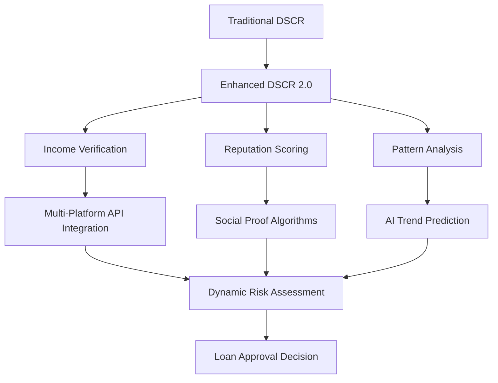

## 🧠 What Is DSCR (And Why It _Used_ to Work)?

<Tip>
  **TL;DR:** Debt-Service Coverage Ratio (DSCR) was built for cubicle salaries, not crypto payments, AI gigs, or nomadic creators with three passports. In an era where your income comes from Twitch, Upwork, and a DAO in Lisbon, we need a new way to underwrite reality.
</Tip>

The **Debt-Service Coverage Ratio** (DSCR) is a traditional lending metric used by banks to evaluate how well your income covers your debt obligations. In short:

<Frame caption="Traditional DSCR Formula">
  **DSCR = Net Operating Income / Total Debt Service**
</Frame>

<Accordion title="Understanding DSCR with Examples">
  If your DSCR is 1.2, that means you're earning 20% more than your debt costs. Banks love this. It's clean, predictable, and assumes a monthly paycheck.

  **Traditional Example:**

  - Monthly salary: \$6,000
  - Monthly debt payments: \$2,000
  - DSCR: 6,000 ÷ 2,000 = 3.0 ✅ (Excellent)
</Accordion>

But here's the problem: **Modern incomes aren't clean. Or predictable. Or even monthly.**

<Warning>
  The traditional DSCR model assumes a W2 employee with consistent monthly income. This breaks down completely for the modern gig economy worker.
</Warning>

## 🌍 Nomads, Creators, and Remote Workers Broke the Formula

Let's say you're a:

<CardGroup cols={2}>
  <Card title="🌴 Travel YouTuber" icon="video">
    Filming content in Bali with sponsorship deals and ad revenue
  </Card>
  <Card title="👨‍💻 Remote Developer" icon="code">
    Juggling five clients across different time zones
  </Card>
  <Card title="🎨 NFT Artist" icon="palette">
    Creating digital art with volatile income spikes
  </Card>
  <Card title="🤖 AI Prompt Engineer" icon="robot">
    Earning per output with emerging AI platforms
  </Card>
</CardGroup>

Your income is _real_—but your DSCR looks chaotic. Why?

<AccordionGroup>
  <Accordion title="Variable Pay Cycles">
    Unlike traditional bi-weekly paychecks, modern workers receive payments:

    - Weekly from platforms like Upwork
    - Per milestone from project clients
    - Monthly from subscription services
    - Instantly from tokenized platforms
  </Accordion>
  <Accordion title="Global Income Sources">
    No central employer means income flows from:

    - Multiple international clients
    - Various platforms and marketplaces
    - Different currencies and payment methods
    - Decentralized autonomous organizations (DAOs)
  </Accordion>
  <Accordion title="Non-Salary Revenue Streams">
    Modern income includes:

    - Advertising revenue (YouTube, TikTok)
    - Royalties (music, art, content)
    - Sponsorships and brand deals
    - Course sales and digital products
  </Accordion>
  <Accordion title="Multi-Currency Flows">
    Payments arrive in various forms:

    - EUR from European clients
    - USD from American platforms
    - Cryptocurrency payments
    - Local currencies from regional work
  </Accordion>
</AccordionGroup>

**Result:** Lenders see _risk_, not _resilience_. The spreadsheet fails.

## 🤔 Real World Case Study

<Frame>
  **Anna, 29, runs a Substack, sells Canva templates, and does voiceover gigs.**

  Her monthly breakdown:

  - Substack subscriptions: \$2,500
  - Template sales: \$3,200
  - Voiceover work: \$1,300
  - **Total: \$7,000/month**

  Monthly obligations:

  - Rent: \$1,800
  - Car payment: \$400
  - **Total debt service: \$2,200**

  **Traditional DSCR: 7,000 ÷ 2,200 = 3.18** ✅

  **Bank's decision: REJECTED** ❌

  _Reason: "Income isn't stable enough" despite 24 months of financial receipts_
</Frame>

<Check>
  Anna's actual DSCR of 3.18 is excellent by traditional standards, yet she's denied because her income sources don't fit the legacy model.
</Check>

## 📉 Why DSCR Can't Handle the New Economy

<Info>
  Here's where DSCR assumptions completely break down in the modern economy:
</Info>

| Traditional Assumption | New Economic Reality                       |
| ---------------------- | ------------------------------------------ |
| W2 or fixed salary     | Mixed-income gigs and platforms            |
| National employer      | Global clients and decentralized orgs      |
| Monthly consistency    | Volatile spikes, seasonal patterns         |
| Bank-verified deposits | Crypto wallets, PayPal, Wise, Stripe, etc. |
| Single income stream   | 3-7 different revenue sources              |
| Standard work hours    | 24/7 global marketplace                    |

<CodeGroup>

```python Traditional DSCR Calculation
def calculate_dscr(monthly_salary, monthly_debt):
    return monthly_salary / monthly_debt

# Simple, but broken for modern work
dscr = calculate_dscr(5000, 2000)  # = 2.5
```


```python Modern Income Reality
def calculate_modern_income(income_streams):
    platforms = ['upwork', 'youtube', 'substack', 'crypto']
    total = 0
    for stream in income_streams:
        # Each stream has different:
        # - Payment schedules
        # - Currency types  
        # - Volatility patterns
        # - Verification methods
        total += normalize_stream(stream)
    return total

# Complex, variable, but more realistic
```

</CodeGroup>

## 🧪 AI \+ Agent-Led Solutions: A New Underwriting Layer

<Card title="Decentralized AI Underwriting" icon="brain">
  Autonomous financial agents (like those from AlgoForge or SynthFi) that revolutionize loan assessment by:

  ✅ **Crawling multi-stream income** across platforms\
  ✅ **Normalizing patterns** over volatility\
  ✅ **Evaluating tokenized** and fiat inflows\
  ✅ **Integrating social clout**, reputation, and proof-of-work
</Card>

**DSCR 2.0 isn't just numbers — it's narrative-aware.**

<Tabs>
  <Tab title="Social Proof">
    A TikTok tour with 2M views? That's a _rental guarantee_.
  </Tab>
  <Tab title="Recurring Revenue">
    Recurring Ko-fi donations? That's _predictable income_.
  </Tab>
  <Tab title="Platform History">
    3-month Upwork streak? That's _stability_.
  </Tab>
  <Tab title="Reputation Score">
    5-star ratings across platforms? That's _reliability_.
  </Tab>
</Tabs>

### AI-Enhanced Risk Assessment

<Steps>
  <Step title="Data Aggregation">
    AI agents collect income data from multiple sources:

    - Banking APIs and crypto wallets
    - Platform earnings (Upwork, Fiverr, YouTube)
    - Social media engagement metrics
    - Client feedback and ratings
  </Step>
  <Step title="Pattern Recognition">
    Machine learning identifies:

    - Seasonal income patterns
    - Growth trajectories
    - Risk indicators
    - Stability markers
  </Step>
  <Step title="Narrative Analysis">
    AI evaluates qualitative factors:

    - Professional reputation
    - Audience engagement
    - Content quality
    - Market positioning
  </Step>
  <Step title="Dynamic Scoring">
    Generates a comprehensive risk profile that updates in real-time
  </Step>
</Steps>

## 💡 Towards a Vibe-Based DSCR?

<Note>
  We're not saying abandon risk metrics — we're saying **upgrade them**.
</Note>

### Enhanced Assessment Criteria

<CardGroup cols={3}>
  <Card title="Qualitative Filters" icon="star">
    - Reputation scores
    - Client reviews
    - Audience engagement
    - Professional networks
  </Card>
  <Card title="AI-Verified Flows" icon="chart-line">
    - API-based gig scraping
    - Social income verification
    - Cross-platform validation
    - Real-time income tracking
  </Card>
  <Card title="Pattern Recognition" icon="brain-circuit">
    - Financial health mapping
    - Trend analysis
    - Seasonal adjustments
    - Growth predictions
  </Card>
</CardGroup>

### The New Metrics Framework



## 🔮 Future of Loans for Remote Workers and Nomads

<Tip>
  The lending industry is evolving to meet the needs of the modern workforce. Here's what's changing:
</Tip>

| Old Way                 | New Way                                |
| ----------------------- | -------------------------------------- |
| 1.2 DSCR cutoff         | Adaptive, longitudinal thresholds      |
| Bank account statements | Platform \+ wallet-based flow analysis |
| Credit score dependency | AI reputation graphs, on-chain proof   |
| Static forms            | Dynamic underwriting via AI agents     |
| Single snapshot         | Continuous monitoring                  |
| Local verification      | Global income validation               |

### Emerging Technologies

<AccordionGroup>
  <Accordion title="Blockchain Verification">
    Smart contracts can verify income streams automatically:

    - On-chain transaction history
    - Decentralized identity verification
    - Automated escrow systems
    - Tokenized income streams
  </Accordion>
  <Accordion title="API-First Banking">
    Modern financial institutions integrate directly with:

    - Freelancing platforms
    - E-commerce marketplaces
    - Social media monetization
    - Cryptocurrency exchanges
  </Accordion>
  <Accordion title="AI Risk Models">
    Machine learning algorithms that:

    - Process unstructured data
    - Identify subtle patterns
    - Predict future performance
    - Adapt to new income models
  </Accordion>
</AccordionGroup>

## 🧳 Final Thoughts

<Frame>
  **If your income moves at the speed of Wi-Fi, your underwriting model can't be stuck in 2003 Excel sheets.**
</Frame>

DSCR, as it stands, is fundamentally broken for the modern economy. The nomadic, gig-first, AI-augmented world needs a new scoring system that recognizes:

- **Income diversity as strength**, not weakness
- **Platform reputation as collateral**
- **Global mobility as opportunity**, not risk
- **Technology integration as standard practice**

The future belongs to lenders who can see beyond traditional employment and recognize the new economy's potential.

---

## 🔧 Interactive Tools

<Card title="Nomad Income Normalizer" icon="calculator" href="https://fc.firuz-alimov.com/app">
  Upload your last 6 months of platform, wallet, or invoice income and get:

  - **Stability Index calculation**
  - **Estimated Vibe-DSCR score**
  - **Risk assessment breakdown**
  - **Improvement recommendations**

  _Try the calculator →_
</Card>

<CardGroup cols={2}>
  <Card title="DSCR Calculator" icon="chart-bar" href="https://fc.firuz-alimov.com/app">
    Calculate traditional and enhanced DSCR ratios
  </Card>
  <Card title="Income Analyzer" icon="magnifying-glass" href="https://fc.firuz-alimov.com/app">
    Analyze multi-stream income patterns
  </Card>
</CardGroup>

### Related Resources

<CardGroup cols={3}>
  <Card title="Loan Calculator" icon="calculator" href="https://fc.firuz-alimov.com/app">
    Traditional and modern loan calculations
  </Card>
  <Card title="Cash Flow Analyzer" icon="chart-line" href="https://fc.firuz-alimov.com/app">
    Multi-stream income flow analysis
  </Card>
  <Card title="Risk Assessment Tool" icon="shield-check" href="https://fc.firuz-alimov.com/app">
    Comprehensive financial risk evaluation
  </Card>
</CardGroup>

---

<Info>
  **Want to dive deeper?** Check out our comprehensive guides on [modern lending practices](https://fc.firuz-alimov.com/guides/modern-lending) and [alternative credit scoring](https://fc.firuz-alimov.com/guides/alt-credit).
</Info>